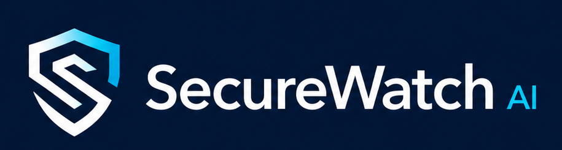
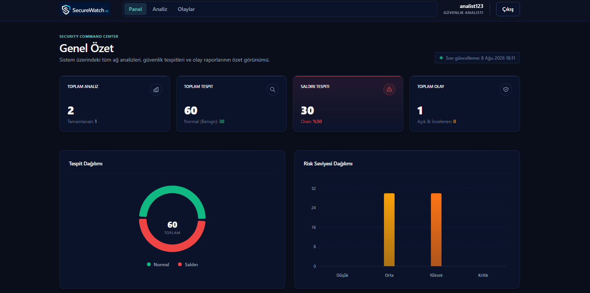
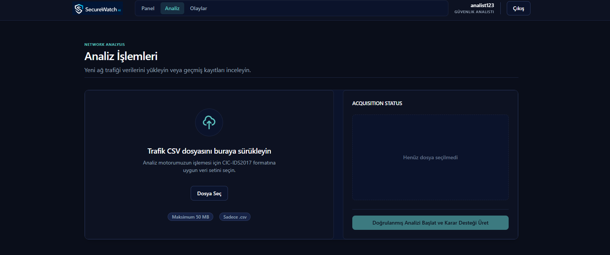
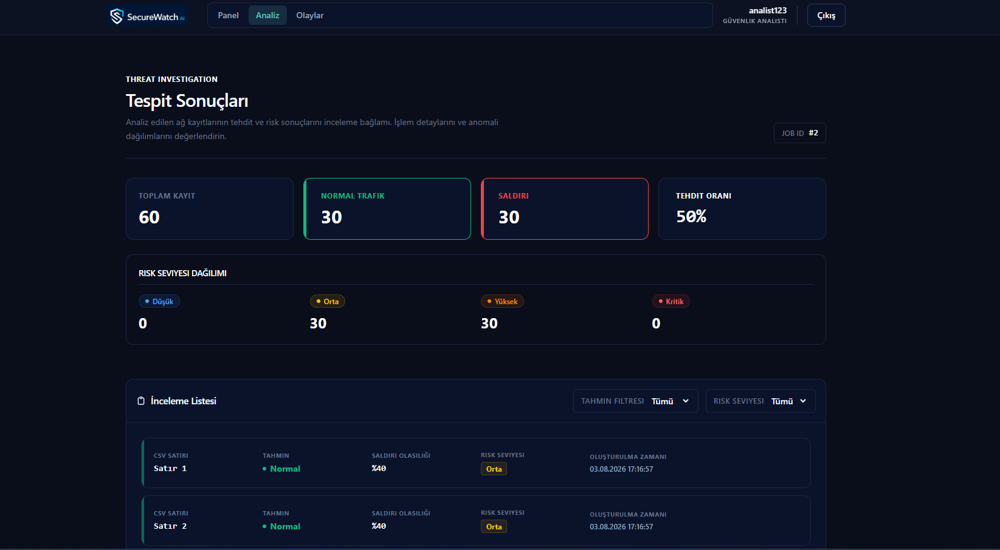
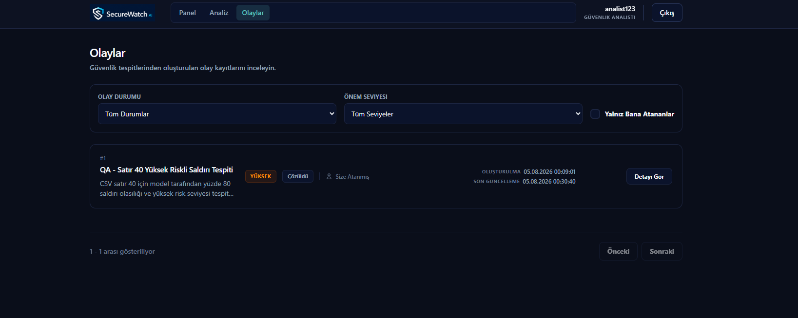

<p align="center">
  
</p>

<h1 align="center">SecureWatch AI</h1>

Yapay zekâ destekli ağ trafiği analizi ve saldırı tespit karar destek platformu.

## Projenin Amacı

SecureWatch AI, ağ trafiği kayıtlarını makine öğrenmesi yöntemleriyle analiz ederek normal ve şüpheli bağlantıları sınıflandıran, model sonuçlarını açıklanabilir risk skorlarıyla sunan ve yüksek riskli kayıtları yönetilebilir güvenlik olaylarına dönüştüren web tabanlı bir karar destek platformudur.

> **Önemli:** Bu proje üretim ortamında kullanılabilecek gerçek zamanlı bir IDS/IPS değildir. Akademik ve kurumsal karar destek prototipi olarak geliştirilmektedir.

### Temel Kullanım Akışı
- **Kullanıcı Kimlik Doğrulaması:** Sistem yöneticisi veya güvenlik analisti olarak güvenli giriş yapılması.
- **Veri Yükleme:** Güvenlik analistleri tarafından CIC-IDS2017 uyumlu CSV ağ trafik verilerinin platforma yüklenmesi.
- **Batch Analiz:** Yüklenen verilerin güvenli bir şekilde doğrulanarak yapay zeka modeli ile senkron toplu analize (batch inference) sokulması.
- **Risk Sınıflandırması:** Analiz sonucunda ağ kayıtlarının normal/saldırı olarak tahmin edilmesi ve uygun risk seviyelerine (LOW, MEDIUM, HIGH, CRITICAL) ayrılması.
- **Olay Yönetimi:** Yüksek riskli ve şüpheli tespitlerin birleştirilerek güvenlik olayı (Incident) dosyalarına dönüştürülmesi ve analistlere atanması.
- **Dashboard ve İzleme:** Tüm analizlerin, tespitlerin ve olayların güncel durumunun özet metrikler ve grafikler üzerinden takip edilmesi.

## Canlı Demo ve Yayın Durumu

| Servis | Bağlantı |
|---|---|
| **Frontend** | [https://securewatch-ai-three.vercel.app](https://securewatch-ai-three.vercel.app/) |
| **Backend Health** | [https://securewatch-ai-25yd.onrender.com/api/v1/health](https://securewatch-ai-25yd.onrender.com/api/v1/health) |
| **Swagger UI** | [https://securewatch-ai-25yd.onrender.com/docs](https://securewatch-ai-25yd.onrender.com/docs) |

### Dağıtım Topolojisi

* **Vercel:** React/TypeScript/Vite tabanlı frontend uygulaması
* **Render:** FastAPI backend servisi ve paketlenmiş demo çıkarım modeli
* **Neon:** PostgreSQL üretim veritabanı

### Doğrulanan Canlı Akış

Aşağıdaki üretim akışı canlı ortamda manuel olarak doğrulanmıştır:

* ANALYST hesabıyla kimlik doğrulama
* CIC-IDS2017 uyumlu CSV yükleme
* toplu çıkarım (batch inference)
* tespit ve risk sonuçlarının görüntülenmesi
* tespitin güvenlik olayına dönüştürülmesi
* analistin olayı üzerine alması
* olay yorumlarının eklenmesi
* olayın çözüldü olarak kapatılması
* ADMIN hesabıyla kimlik doğrulama
* analiz, dashboard, olay, atama ve yorum kayıtlarının yönetici görünümünde doğrulanması

### Rol Özeti

* **ANALYST:** CSV dosyalarını yükler, analizleri başlatır, sonuçları inceler, tespitleri olaya dönüştürür, olayları üzerine alır, yorum ekler ve olayları kapatır.
* **ADMIN:** Platform genelindeki analiz işlerini, dashboard metriklerini, olayları, atamaları ve yorumları izler.
* CSV yükleme işlemi yalnızca ANALYST hesaplarına açıktır.

### Canlı Demo Kısıtları

> **ÖNEMLİ UYARI:** Bu uygulama akademik bir karar destek prototipidir; üretim ortamına uygun gerçek zamanlı bir IDS/IPS değildir.

* Paketlenmiş model `local-qa-synthetic` olarak tanımlanmıştır ve yalnızca kontrollü demo/entegrasyon doğrulaması amacıyla kullanılmaktadır.
* Model çıktıları gerçek üretim saldırı tespit başarımı olarak sunulmamalıdır.
* Render Free, hareketsizlik sonrasında uykuya geçebilir; ilk istek yaklaşık 50 saniye veya daha uzun sürebilir.
* Render Free yerel depolaması geçicidir. Yüklenen CSV dosyaları servis yeniden başlatıldığında, yeniden dağıtıldığında veya uykuya geçtiğinde silinebilir.
* Mevcut demo yayınında CSV dosyası aynı aktif oturumda yüklenmeli ve hemen işlenmelidir.
* Kullanıcı adları, parolalar, token’lar, veritabanı bağlantı dizeleri ve gizli ortam değerleri yayımlanmamalıdır.
## Uygulama Görüntüleri

| Güvenlik Dashboard'u | Analiz Çalışma Alanı |
| :---: | :---: |
| [](docs/assets/screenshots/dashboard-overview.png) | [](docs/assets/screenshots/analysis-workspace.png) |
| *Sistemin genel güvenlik durumunu ve özet metrikleri gösteren görünüm.* | *Yeni analiz başlatma ve geçmiş analizleri izleme alanı.* |

| Tespit Sonuçları | Olay Yönetimi |
| :---: | :---: |
| [](docs/assets/screenshots/detection-results.png) | [](docs/assets/screenshots/incident-list.png) |
| *Tamamlanan analizdeki tespitlerin ve risk dağılımlarının listesi.* | *Güvenlik olaylarının durum, atama ve önceliğe göre takip edildiği alan.* |

## Temel Özellikler

- **Kimlik Doğrulama & Güvenlik:** JWT (JSON Web Token) tabanlı oturum yönetimi, `bcrypt` ile güvenli parola hashleme ve saklama tamamlandı.
- **Rol Tabanlı Erişim Kontrolü (RBAC):** `ADMIN` (Sistem Yöneticisi) ve `ANALYST` (Güvenlik Analisti) rolleri ile sıkı uç nokta yetkilendirmesi.
- **Denetim Günlükleri (Audit Logging):** Kritik kullanıcı eylemlerinin istemci IP adresi ve zaman damgası ile otomatik kaydı; ilişkili kullanıcı silinse dahi logların korunması (`ON DELETE SET NULL`).
- **Veri Yükleme:** CIC-IDS2017 formatında (78 zorunlu özellik, 1 opsiyonel Label) ağ trafiği verilerinin güvenli şekilde yüklenmesi. Dosya boyutu, uzantı/MIME, şema doğrulaması ve SHA-256 kopya kontrolü uygulanır.
- **Makine Öğrenmesi & Model Seçimi:** CIC-IDS2017 eğitim verisi hazırlama (±inf/NaN temizliği, mükerrerlik eleme), scikit-learn ön işleme pipeline'ı ve sızıntı korumalı (leakage-safe) train/test ayrımı üzerine Logistic Regression, DummyClassifier ve Random Forest varyantlarının (baseline, deeper, unweighted, compact) karşılaştırma altyapısı geliştirildi. ROC-AUC ve PR-AUC olasılık metrikleri hesaplanarak, karar eşiğinin eğitim verisindeki Out-of-Fold (OOF) validation olasılıklarıyla seçildiği deterministik model seçim servisi kuruldu.
- **Batch Inference ve API:** Eğitilmiş model paketleriyle senkron batch inference desteği. Karar eşiğinden bağımsız olarak olasılık değerlerini operasyonel önem aralıklarına (`LOW`, `MEDIUM`, `HIGH`, `CRITICAL`) ayıran risk sınıflandırma politikası uygulandı.
- **Olay Yönetimi (Incident Management):** Yüksek riskli tespitlerin izlenebilir güvenlik olaylarına (Incident) dönüştürülmesi, atama, durum takibi ve yorum/zaman çizelgesi yönetimi tamamlandı.
- **Dashboard ve Raporlama:** Sistemdeki analiz işlerinin, tespit dağılımlarının ve açık güvenlik olaylarının anlık istatistiklerini sağlayan genel bakış paneli tamamlandı.
- **Test ve Entegrasyon:** Uçtan uca test (backend ve frontend) ve Docker konteynerizasyon entegrasyonu tamamen tamamlandı.

## Teknoloji Yığını

| Katman | Teknoloji |
|--------|-----------|
| **Frontend** | React, TypeScript, Vite, Tailwind CSS, Recharts |
| **Frontend Sunucusu** | Nginx (Production Runtime) |
| **Backend** | Python, FastAPI, Pydantic, SQLAlchemy, Alembic, PyJWT, bcrypt |
| **Veritabanı** | PostgreSQL |
| **Makine Öğrenmesi**| Pandas, NumPy, scikit-learn, Joblib |
| **Test** | Pytest, HTTPX, Vitest, React Testing Library |
| **DevOps** | Docker, Docker Compose |

---

## Güvenlik, RBAC ve API Uç Noktaları

Platform, güvenli erişim ve denetlenebilirlik için sıkı güvenlik katmanlarına sahiptir:

### Rol Tabanlı Erişim (RBAC) Yetki Matrisi

| Endpoint | HTTP Metodu | Erişim Rolü | Açıklama |
|----------|-------------|-------------|----------|
| `/api/v1/auth/login` | `POST` | `PUBLIC` | Kullanıcı adı ve parola ile giriş yapar, JWT token döner. |
| `/api/v1/users` | `GET`, `POST` | `ADMIN` | Kullanıcı oluşturur ve listeler. `USER_CREATED` audit kaydı düşer. |
| `/api/v1/audit-logs` | `GET` | `ADMIN` | Sistem denetim günlüklerini listeler. |
| `/api/v1/analysis/upload`| `POST` | `ANALYST` | CIC-IDS2017 CSV dosyası yükler, doğrular ve analiz işi oluşturur. |
| `/api/v1/analysis` | `GET` | `ADMIN`, `ANALYST`| Analiz işlerini listeler. |
| `/api/v1/analysis/{id}` | `GET` | `ADMIN`, `ANALYST`| Analiz detayını getirir. |
| `/api/v1/analysis/{id}/process`| `POST` | `ADMIN`, `ANALYST`| Bekleyen bir analizi senkron çalıştırır ve inference işlemlerini gerçekleştirir. |
| `/api/v1/analysis/{id}/results`| `GET` | `ADMIN`, `ANALYST`| Tamamlanmış analiz tespitlerini (sonuçları) getirir. |
| `/api/v1/analysis/{id}/summary`| `GET` | `ADMIN`, `ANALYST`| Analize ait risk özet metriklerini getirir. |
| `/api/v1/detections/{id}`| `GET` | `ADMIN`, `ANALYST`| Tekil tespit (detection) detayını getirir. |
| `/api/v1/incidents` | `POST`, `GET` | `ADMIN`, `ANALYST`| Güvenlik olaylarını sayfalı listeler veya tespitlerden yeni olay oluşturur. |
| `/api/v1/incidents/{id}` | `GET`, `PATCH`| `ADMIN`, `ANALYST`| Olayın detayını okur ve durumunu/atanan kişiyi günceller. |
| `/api/v1/incidents/{id}/comments`| `POST` | `ADMIN`, `ANALYST`| Güvenlik olayına analiz notu/yorum ekler. |
| `/api/v1/dashboard/summary`| `GET` | `ADMIN`, `ANALYST`| Dashboard paneli için toplu metrik istatistiklerini getirir. |

Ayrıntılı API uç nokta sözleşmeleri ve hata kodları için bkz. [06-api-endpoints.md](docs/architecture/06-api-endpoints.md).

---

## Kurulum ve Çalıştırma

### Docker ile Hızlı Başlangıç (Doğrulandı)

Uygulamanın hem frontend hem backend servisleri PostgreSQL veritabanı ile birlikte Docker Compose kullanılarak tek bir komutta güvenli şekilde başlatılabilir.

1. `.env.example` dosyasını ana dizinde `.env` adıyla kopyalayın:
   ```bash
   cp .env.example .env
   ```
2. Oluşturduğunuz `.env` dosyası içindeki gizli bilgileri (`POSTGRES_PASSWORD` ve `JWT_SECRET_KEY`) güvenli değerlerle doldurun. *(Projeyi başlatmak için kendi secret'larınızı belirlemeniz zorunludur).*
3. Docker Compose ile projeyi başlatın:
   ```bash
   docker compose up --build -d
   ```
4. Uygulamaya tarayıcınızdan **http://localhost:8080** adresi üzerinden erişin.
5. Konteyner servis sağlıklarını (healthcheck) kontrol etmek için:
   ```bash
   docker compose ps
   ```
6. Ortamı durdurmak ve temizlemek için:
   ```bash
   docker compose down
   ```

### Backend Yerel Kurulumu (Doğrulandı)

Geliştirme ortamında (Docker kullanılmadığında) PostgreSQL çalışıyor olmalıdır.

```powershell
cd backend
python -m venv .venv
.venv\Scripts\Activate.ps1
python -m pip install --upgrade pip
python -m pip install -r requirements.txt
copy .env.example .env
# .env içinde DATABASE_URL, POSTGRES_PASSWORD ve JWT_SECRET_KEY doldurun
python -m alembic upgrade head
python -m uvicorn app.main:app --reload
```
- Health Endpoint: `http://127.0.0.1:8000/api/v1/health`
- Swagger UI: `http://127.0.0.1:8000/docs`

### Frontend Yerel Kurulumu (Doğrulandı)

```powershell
cd frontend
npm install
npm run dev
```
- Uygulama: `http://localhost:5173` (Vite dev server) üzerinden çalışacaktır.

### Demo Kullanıcı Oluşturma

İlk kurulumda sisteme giriş yapabilmek için gerekli test/demo kullanıcıları (ADMIN ve ANALYST rollerinde) güvenli CLI betiğiyle oluşturulabilir.

**Uyarı:** Kimlik bilgileri statik olarak kodlanmamıştır ve çalışma zamanında çevre değişkenlerinden (environment variables) alınır.

```bash
cd backend
# Terminal oturumunuzda şu değişkenleri export / set etmeniz zorunludur:
# DEMO_ADMIN_USERNAME, DEMO_ADMIN_PASSWORD
# DEMO_ANALYST_USERNAME, DEMO_ANALYST_PASSWORD

python -m scripts.create_demo_users
```

---

## Final Doğrulama Sonuçları

Platformun sürümü, tüm bileşenlerinde gerçekleştirilen katı kalite kapılarından ve testlerden başarıyla geçmiştir:

- **Backend Testleri:** 502 test başarılı (Birim ve Entegrasyon testleri).
- **Backend Güvenlik Modülü:** İzolasyonlu kritik backend `auth` paketi 194 test başarılı.
- **Frontend Testleri:** Toplam 34 test dosyasında 791 test (%100) başarılı (Vitest & React Testing Library).
- **TypeScript:** Frontend statik tip kontrolü (`npm run type-check`) hatasız.
- **ESLint:** Kod kalite standardı denetiminde 0 hata, 0 uyarı.
- **Güvenlik Taraması (npm audit):** 0 güvenlik açığı (0 vulnerabilities).
- **Production Build:** Vite ve Nginx optimizasyonlu build başarılı. *(Bilinen chunk-size uyarıları bir build hatası değil, planlanmış bir teknik borçtur).*
- **Docker Compose:** `no-cache` ve multistage production build süreçleri başarılı.
- **Healthchecks:** PostgreSQL, FastAPI Backend ve Nginx Frontend Container sağlık denetimleri (healthchecks) tam başarılı. Backend API health endpointi sorunsuz `HTTP 200` dönmektedir.

---

## Teknik Dokümantasyon

Mimari kararlar, veri şemaları ve makine öğrenmesi değerlendirmelerine ait detaylı dokümanlar `docs/` dizini altındadır:

- **Sistem Mimarisi:** [05-system-architecture.md](docs/architecture/05-system-architecture.md)
- **Veritabanı ve ER Diyagramı:** [03-database-design.md](docs/architecture/03-database-design.md)
- **API Sözleşmesi:** [06-api-endpoints.md](docs/architecture/06-api-endpoints.md)
- **ML Eğitim ve Inference Mimarisi:** [07-ml-training-and-inference.md](docs/architecture/07-ml-training-and-inference.md)
- **Model Seçim Raporu:** [day-10-model-selection-report.md](docs/model-evaluation/day-10-model-selection-report.md)
- **Model Card:** [model-card.md](docs/model-evaluation/model-card.md)

---

## GitHub Çalışma Disiplini

- Her özellik için ayrı branch kullanılmış ve `main` branchine yalnızca Pull Request ve onay (code review) sonrası birleştirme yapılmıştır.
- Commitler "Conventional Commits" standardında küçük ve amaca yönelik atılmıştır.
- Projeye katkı süreçleri `CONTRIBUTING.md` kurallarına (planlandı) uygun olarak yürütülür.

## Lisans ve Güvenlik Notu

- Projenin lisansı henüz belirlenmemiştir.
- Bu proje yalnızca eğitim ve analiz amaçlıdır.
- Gerçek sistemlere saldırı göndermek veya port taraması yapmak için kullanılamaz.
- Gerçek kurumlara ait hassas ağ trafiği kullanılmaz; kamuya açık akademik CIC-IDS2017 veri seti temel alınır.
- Kullanıcı parolaları `bcrypt` ile hashlenerek saklanır; parolalar asla açık metin olarak kaydedilmez.
- JWT secret ve veritabanı kimlik bilgileri yerel veya dışarıdan enjekte edilen değişkenler üzerinden okunur, kaynak kodda barındırılmaz.