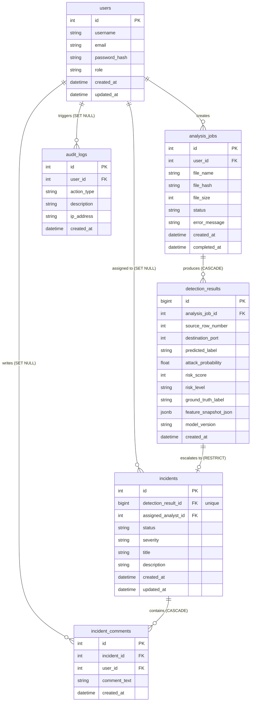

# SecureWatch AI — Veritabanı Tasarımı (Database Design)

Bu belge, SecureWatch AI projesinin ilişkisel veritabanı şemasını, tabloları, sütun veri tiplerini, kısıtları ve silme politikalarını ayrıntılandırır.

## 1. Veritabanı Genel Şeması
Sistem verileri, bütünlük kısıtları ve ilişkisel kurallarla yönetilen **PostgreSQL** veritabanında saklanır. Şema tasarımı; kullanıcı hesapları, analiz işleri, makine öğrenmesi tahmin sonuçları, güvenlik olayları ve sistem günlüklerinin izlenebilirliğini sağlamak üzere yapılandırılmıştır.

## 2. Varlık-İlişki (ER) Diyagramı
Aşağıdaki Mermaid diyagramı veritabanındaki tabloları ve aralarındaki ilişkileri göstermektedir:

---

## 3. Veri Sözlüğü (Tablo Tanımları)

### 3.1. `users` Tablosu
Sisteme erişebilen yöneticileri ve güvenlik analistlerini barındırır.
*   `id` (Serial, Primary Key): Benzersiz kullanıcı numarası.
*   `username` (Varchar(50), Unique, Not Null): Kullanıcı adı.
*   `email` (Varchar(100), Unique, Not Null): E-posta adresi.
*   `password_hash` (Varchar(255), Not Null): Parolanın bcrypt hash değeri.
*   `role` (Varchar(20), Not Null): Kullanıcının rolü (`ADMIN` veya `ANALYST`).
*   `created_at` (Timestamp, Default: Now()): Hesabın oluşturulma tarihi.
*   `updated_at` (Timestamp, Default: Now()): Hesabın son güncellenme tarihi.

### 3.2. `analysis_jobs` Tablosu
Analistler tarafından yüklenen ağ trafiği CSV dosyalarının batch analiz süreçlerini takip eder.
*   `id` (Serial, Primary Key): Benzersiz analiz numarası.
*   `user_id` (Integer, Foreign Key): Analizi başlatan kullanıcının ID'si.
*   `file_name` (Varchar(255), Not Null): Yüklenen orijinal dosyanın adı.
*   `file_hash` (Varchar(64), Unique, Not Null): Dosyanın SHA-256 hash değeri (mükerrer yüklemeleri önlemek için).
*   `file_size` (Integer, Not Null): Dosyanın byte cinsinden boyutu.
*   `status` (Varchar(20), Default: 'PENDING', Not Null): İş durumu (`PENDING`, `PROCESSING`, `COMPLETED`, `FAILED`).
*   `error_message` (Text, Nullable): İşlem başarısız olursa oluşan hata mesajı.
*   `created_at` (Timestamp, Default: Now()): Yükleme ve iş başlama zamanı.
*   `completed_at` (Timestamp, Nullable): Tahmin işlemlerinin tamamlanma zamanı.

### 3.3. `detection_results` Tablosu
Modelleme ve batch tahmin sonrasında üretilen detaylı trafik akışı analiz sonuçlarını saklar.
> **Not:** CIC-IDS2017 MachineLearningCSV şemasında `source_ip`, `destination_ip`, `source_port` ve `protocol` bilgileri yer almadığı için veritabanı bütünlüğü gereği bu alanlar tabloya eklenmemiştir.
*   `id` (BigSerial, Primary Key): Benzersiz kayıt numarası.
*   `analysis_job_id` (Integer, Foreign Key): Bağlı olduğu analiz işinin ID'si.
*   `source_row_number` (Integer, Not Null): Orijinal CSV dosyasındaki satır numarası (izlenebilirliği sağlamak için).
*   `destination_port` (Integer, Not Null): Hedef port numarası (akıştan çıkarılan tek ağ bilgisi).
*   `predicted_label` (Varchar(50), Not Null): Modelin tahmini (0: normal/BENIGN, 1: saldırı).
*   `attack_probability` (Float, Not Null): Modelin atadığı saldırı olasılığı (0.0 - 1.0).
*   `risk_score` (Integer, Not Null): Olasılıktan üretilen sayısal risk değeri (0 - 100).
*   `risk_level` (Varchar(20), Not Null): Risk seviyesi (`LOW`, `MEDIUM`, `HIGH`, `CRITICAL`).
*   `ground_truth_label` (Varchar(50), Nullable): Veri setinde varsa orijinal etiket (model doğrulaması için).
*   `feature_snapshot_json` (JSONB, Not Null): Analiz edilen trafik akışının 78 adet orijinal özelliğinin tamamını içeren JSON nesnesi.
*   `model_version` (Varchar(50), Not Null): Tahmini yürüten ML modelinin sürümü.
*   `created_at` (Timestamp, Default: Now()): Kayıt zamanı.

### 3.4. `incidents` Tablosu
Tespit edilen tehditlerin analistler tarafından güvenlik olayına dönüştürülmüş kayıtlarıdır.
*   `id` (Serial, Primary Key): Benzersiz olay numarası.
*   `detection_result_id` (BigInteger, Foreign Key, Unique, Not Null): Olayın temel aldığı tespit kaydının ID'si.
*   `assigned_analyst_id` (Integer, Foreign Key, Nullable): Olayı incelemekle görevlendirilen analistin kullanıcı ID'si.
*   `status` (Varchar(20), Default: 'OPEN', Not Null): Olay durumu (`OPEN`, `IN_PROGRESS`, `RESOLVED`, `FALSE_POSITIVE`).
*   `severity` (Varchar(20), Not Null): Olayın aciliyet/önem derecesi (`LOW`, `MEDIUM`, `HIGH`, `CRITICAL`).
*   `title` (Varchar(150), Not Null): Olay başlığı.
*   `description` (Text, Not Null): Olayın detaylı açıklaması.
*   `created_at` (Timestamp, Default: Now()): Olayın oluşturulma tarihi.
*   `updated_at` (Timestamp, Default: Now()): Son güncelleme tarihi.

### 3.5. `incident_comments` Tablosu
Güvenlik olayları altına analistlerin eklediği inceleme notları ve yorumları içerir.
*   `id` (Serial, Primary Key): Benzersiz yorum numarası.
*   `incident_id` (Integer, Foreign Key): Bağlı olduğu güvenlik olayının ID'si.
*   `user_id` (Integer, Foreign Key): Yorumu yazan kullanıcının ID'si.
*   `comment_text` (Text, Not Null): Yorum içeriği.
*   `created_at` (Timestamp, Default: Now()): Yorum zamanı.

### 3.6. `audit_logs` Tablosu
Sistem üzerindeki idari ve operasyonel işlemlerin geriye dönük denetim loglarını tutar.
*   `id` (Serial, Primary Key): Benzersiz günlük numarası.
*   `user_id` (Integer, Foreign Key, Nullable): Eylemi gerçekleştiren kullanıcının ID'si.
*   `action_type` (Varchar(50), Not Null): Gerçekleştirilen işlem türü (örn. 'USER_LOGIN', 'FILE_UPLOAD', 'INCIDENT_UPDATE').
*   `description` (Text, Not Null): Eylemin detaylı açıklaması (Kullanıcı silinse dahi bu açıklama metni korunacaktır).
*   `ip_address` (Varchar(45), Not Null): İşlemin yapıldığı istemci IP adresi.
*   `created_at` (Timestamp, Default: Now()): İşlem zamanı.

---

## 4. İlişkiler ve Bütünlük Kısıtları (Silme Politikaları)

Veritabanındaki yabancı anahtar (Foreign Key) ilişkilerinde bütünlüğü korumak için uygulanan silme kuralları ve gerekçeleri aşağıda açıklanmıştır:

1.  **`users` -> `analysis_jobs` (`ON DELETE RESTRICT`):**
    - *Gerekçe:* Bir kullanıcı (analist) sistemden silinmek istendiğinde, eğer bu kullanıcının başlattığı geçmiş analiz işleri varsa sistem silme işlemini engellemelidir (`RESTRICT`). Bu durum, geçmiş analizlerin ve veri tabanı geçmişinin kaybolmasını engeller. Kullanıcıyı silmek için önce iş kayıtlarının arşivlenmesi veya başka bir kullanıcıya devredilmesi gerekir.

2.  **`users` -> `audit_logs` (`ON DELETE SET NULL`):**
    - *Gerekçe:* Bir yönetici veya analist hesabı silinse dahi, o kullanıcının geçmişte tetiklediği sistem denetim günlükleri (`audit_logs`) asla silinmemelidir. Bu nedenle `user_id` alanı `SET NULL` yapılır. Eylemin kimin tarafından yapıldığına dair orijinal bilgi, `audit_logs.description` alanında metinsel olarak zaten saklandığı için denetim izlenebilirliği korunur.

3.  **`analysis_jobs` -> `detection_results` (`ON DELETE CASCADE`):**
    - *Gerekçe:* Bir analiz işi (`analysis_jobs`) sistemden kaldırıldığında, o işe bağlı olarak üretilmiş binlerce/milyonlarca satırlık tahmin sonuçları (`detection_results`) veritabanında gereksiz yer kaplamaması için otomatik olarak silinmelidir (`CASCADE`).

4.  **`detection_results` -> `incidents` (`ON DELETE RESTRICT`):**
    - *Gerekçe:* Bir analist, tespit edilen bir tehdidi güvenlik olayına (`incidents`) dönüştürdüyse, bu olayla ilişkili olan ham tespit sonucu (`detection_results`) veritabanından silinemez (`RESTRICT`). Güvenlik olayının teknik kanıtı korunmak zorundadır.

5.  **`incidents` -> `incident_comments` (`ON DELETE CASCADE`):**
    - *Gerekçe:* Bir güvenlik olayı veritabanından silindiğinde (örneğin test ortamında temizlik yapıldığında), o olay altına yazılmış olan tüm yorum ve notlar da işlevini yitireceği için otomatik olarak silinmelidir (`CASCADE`).

6.  **`users` -> `incidents` (`ON DELETE SET NULL`):**
    - *Gerekçe:* Bir güvenlik olayına atanan analist (`assigned_analyst_id`) sistemden silinirse, olay silinmez. Sadece `assigned_analyst_id` alanı `NULL` yapılarak olay tekrar atanmamış (`unassigned`) statüsüne düşürülür.

7.  **`users` -> `incident_comments` (`ON DELETE SET NULL`):**
    - *Gerekçe:* Yorum yazan analist hesabı silinse bile, olayın geçmişinde yer alan teknik analiz notları korunmalıdır. Bu nedenle yorumu yazan kullanıcı referansı `SET NULL` yapılarak yorum metni korunmaya devam eder.
