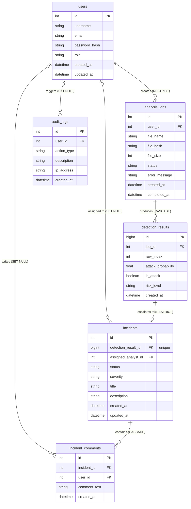

# SecureWatch AI — Veritabanı Tasarımı (Database Design)

Bu belge, SecureWatch AI projesinin ilişkisel veritabanı şemasını, tabloları, sütun veri tiplerini, kısıtları ve silme politikalarını ayrıntılandırır.

## 1. Veritabanı Genel Şeması
Sistem verileri, bütünlük kısıtları ve ilişkisel kurallarla yönetilen **PostgreSQL** veritabanında saklanır. Şema tasarımı; kullanıcı hesapları, analiz işleri, makine öğrenmesi tahmin sonuçları, güvenlik olayları ve sistem günlüklerinin izlenebilirliğini sağlamak üzere yapılandırılmıştır.

## 2. Varlık-İlişki (ER) Diyagramı
Aşağıdaki Mermaid diyagramı veritabanındaki tabloları ve aralarındaki ilişkileri göstermektedir:

```mermaid
erDiagram
    users {
        int id PK
        string username
        string email
        string password_hash
        string role
        datetime created_at
        datetime updated_at
    }

    analysis_jobs {
        int id PK
        int user_id FK
        string file_name
        string file_hash
        int file_size
        string status
        string error_message
        datetime created_at
        datetime completed_at
    }

    detection_results {
        bigint id PK
        int job_id FK
        int row_index
        float attack_probability
        boolean is_attack
        string risk_level
        datetime created_at
    }

    incidents {
        int id PK
        bigint detection_result_id FK "unique"
        int assigned_analyst_id FK
        string status
        string severity
        string title
        string description
        datetime created_at
        datetime updated_at
    }

    incident_comments {
        int id PK
        int incident_id FK
        int user_id FK
        string comment_text
        datetime created_at
    }

    audit_logs {
        int id PK
        int user_id FK
        string action_type
        string description
        string ip_address
        datetime created_at
    }

    users ||--o{ analysis_jobs : "creates (RESTRICT)"
    users |o--o{ audit_logs : "triggers (SET NULL)"
    users |o--o{ incidents : "assigned to (SET NULL)"
    users |o--o{ incident_comments : "writes (SET NULL)"
    analysis_jobs ||--o{ detection_results : "produces (CASCADE)"
    detection_results ||--o| incidents : "escalates to (RESTRICT)"
    incidents ||--o{ incident_comments : "contains (CASCADE)"
```

---

## 3. Veri Sözlüğü (Tablo Tanımları)

### 3.1. `users` Tablosu
Sisteme erişebilen yöneticileri ve güvenlik analistlerini barındırır.
*   `id` (Serial, Primary Key): Benzersiz kullanıcı numarası.
*   `username` (Varchar(50), Unique, Not Null): Kullanıcı adı.
*   `email` (Varchar(100), Unique, Not Null): E-posta adresi.
*   `password_hash` (Varchar(255), Not Null): Parolanın bcrypt hash değeri.
*   `role` (Varchar(20), Not Null): Kullanıcının rolü (`ADMIN` veya `ANALYST`).
*   `created_at` (Timestamp, Default: Now()): Hesabın oluşturulma tarihi.
*   `updated_at` (Timestamp, Default: Now()): Hesabın son güncellenme tarihi.

### 3.2. `analysis_jobs` Tablosu
Analistler tarafından yüklenen ağ trafiği CSV dosyalarının batch analiz süreçlerini takip eder.
*   `id` (Serial, Primary Key): Benzersiz analiz numarası.
*   `user_id` (Integer, Foreign Key): Analizi başlatan kullanıcının ID'si.
*   `file_name` (Varchar(255), Not Null): Yüklenen orijinal dosyanın adı.
*   `file_hash` (Varchar(64), Unique, Not Null): Dosyanın SHA-256 hash değeri (mükerrer yüklemeleri önlemek için).
*   `file_size` (Integer, Not Null): Dosyanın byte cinsinden boyutu.
*   `status` (Varchar(20), Default: 'PENDING', Not Null): İş durumu (`PENDING`, `PROCESSING`, `COMPLETED`, `FAILED`).
*   `error_message` (Text, Nullable): İşlem başarısız olursa oluşan hata mesajı.
*   `created_at` (Timestamp, Default: Now()): Yükleme ve iş başlama zamanı.
*   `completed_at` (Timestamp, Nullable): Tahmin işlemlerinin tamamlanma zamanı.

### 3.3. `detection_results` Tablosu
Modelleme ve batch tahmin sonrasında üretilen satır bazlı tespit sonuçlarını saklar.
*   `id` (BigSerial, Primary Key): Benzersiz kayıt numarası.
*   `job_id` (Integer, Foreign Key, Not Null): Bağlı olduğu analiz işinin ID'si (`ON DELETE CASCADE`).
*   `row_index` (Integer, Not Null): Orijinal CSV dosyasındaki 0 tabanlı satır indeksi.
*   `attack_probability` (Float, Not Null): Modelin atadığı saldırı olasılığı (0.0 - 1.0).
*   `is_attack` (Boolean, Not Null): Karar eşiğine dayalı ikili saldırı kararı (`True`/`False`).
*   `risk_level` (Varchar(20), Not Null): Risk seviyesi (`LOW`, `MEDIUM`, `HIGH`, `CRITICAL`).
*   `created_at` (Timestamp, Default: Now()): Kayıt zamanı.

### 3.4. `incidents` Tablosu
Tespit edilen tehditlerin analistler tarafından güvenlik olayına dönüştürülmüş kayıtlarıdır.
*   `id` (Serial, Primary Key): Benzersiz olay numarası.
*   `detection_result_id` (BigInteger, Foreign Key, Unique, Not Null): Olayın temel aldığı tespit kaydının ID'si (`ON DELETE RESTRICT`).
*   `assigned_analyst_id` (Integer, Foreign Key, Nullable): Olayı incelemekle görevlendirilen analistin kullanıcı ID'si (`ON DELETE SET NULL`).
*   `status` (Varchar(20), Default: 'OPEN', Not Null): Olay durumu (`OPEN`, `IN_PROGRESS`, `RESOLVED`, `FALSE_POSITIVE`).
*   `severity` (Varchar(20), Not Null): Olayın aciliyet/önem derecesi (`LOW`, `MEDIUM`, `HIGH`, `CRITICAL`).
*   `title` (Varchar(150), Not Null): Olay başlığı.
*   `description` (Text, Not Null): Olayın detaylı açıklaması.
*   `created_at` (Timestamp, Default: Now()): Olayın oluşturulma tarihi.
*   `updated_at` (Timestamp, Default: Now()): Son güncelleme tarihi.

> **Not:** PostgreSQL native enum tipleri yerine taşınabilirlik ve esneklik sağlamak amacıyla string enum ve uygulama düzeyinde/Check constraint doğrulamaları tercih edilmiştir.

### 3.5. `incident_comments` Tablosu
Güvenlik olayları altına analistlerin eklediği inceleme notları ve yorumları içerir.
*   `id` (Serial, Primary Key): Benzersiz yorum numarası.
*   `incident_id` (Integer, Foreign Key, Not Null): Bağlı olduğu güvenlik olayının ID'si (`ON DELETE CASCADE`).
*   `user_id` (Integer, Foreign Key, Nullable): Yorumu yazan kullanıcının ID'si (`ON DELETE SET NULL`).
*   `comment_text` (Text, Not Null): Yorum içeriği.
*   `created_at` (Timestamp, Default: Now()): Yorum zamanı.

### 3.6. `audit_logs` Tablosu
Sistem üzerindeki idari ve operasyonel işlemlerin geriye dönük denetim loglarını tutar.
*   `id` (Serial, Primary Key): Benzersiz günlük numarası.
*   `user_id` (Integer, Foreign Key, Nullable): Eylemi gerçekleştiren kullanıcının ID'si (`ON DELETE SET NULL`).
*   `action_type` (Varchar(50), Not Null): Gerçekleştirilen işlem türü (örn. 'USER_LOGIN', 'FILE_UPLOAD', 'INCIDENT_CREATED', 'INCIDENT_ASSIGNED', 'INCIDENT_STATUS_CHANGED', 'INCIDENT_COMMENT_ADDED').
*   `description` (Text, Not Null): Eylemin detaylı açıklaması.
*   `ip_address` (Varchar(45), Not Null): İşlemin yapıldığı istemci IP adresi.
*   `created_at` (Timestamp, Default: Now()): İşlem zamanı.

---

## 4. İlişkiler ve Bütünlük Kısıtları (Silme Politikaları)

Veritabanındaki yabancı anahtar (Foreign Key) ilişkilerinde bütünlüğü korumak için uygulanan silme kuralları ve gerekçeleri aşağıda açıklanmıştır:

1.  **`users` -> `analysis_jobs` (`ON DELETE RESTRICT`):**
    - *Gerekçe:* Bir kullanıcı (analist) sistemden silinmek istendiğinde, eğer bu kullanıcının başlattığı geçmiş analiz işleri varsa sistem silme işlemini engeller (`RESTRICT`).

2.  **`users` -> `audit_logs` (`ON DELETE SET NULL`):**
    - *Gerekçe:* Bir yönetici veya analist hesabı silinse dahi, o kullanıcının geçmişte tetiklediği sistem denetim günlükleri (`audit_logs`) asla silinmez.

3.  **`analysis_jobs` -> `detection_results` (`ON DELETE CASCADE`):**
    - *Gerekçe:* Bir analiz işi (`analysis_jobs`) sistemden kaldırıldığında, o işe bağlı olarak üretilmiş tüm tespit sonuçları (`detection_results`) otomatik olarak silinir (`CASCADE`).

4.  **`detection_results` -> `incidents` (`ON DELETE RESTRICT`):**
    - *Gerekçe:* Bir analist, tespit edilen bir tehdidi güvenlik olayına (`incidents`) dönüştürdüyse, bu olayla ilişkili olan ham tespit sonucu (`detection_results`) veritabanından silinemez (`RESTRICT`). Güvenlik olayının kanıtı korunmak zorundadır.

5.  **`incidents` -> `incident_comments` (`ON DELETE CASCADE`):**
    - *Gerekçe:* Bir güvenlik olayı veritabanından silindiğinde, o olay altına yazılmış olan tüm yorumlar da otomatik olarak silinir (`CASCADE`).

6.  **`users` -> `incidents` (`ON DELETE SET NULL`):**
    - *Gerekçe:* Bir güvenlik olayına atanan analist (`assigned_analyst_id`) sistemden silinirse, olay silinmez. Sadece `assigned_analyst_id` alanı `NULL` yapılarak olay tekrar atanmamış (`unassigned`) statüsüne düşürülür.

7.  **`users` -> `incident_comments` (`ON DELETE SET NULL`):**
    - *Gerekçe:* Yorum yazan analist hesabı silinse bile, olayın geçmişinde yer alan teknik analiz notları korunur. `user_id` alanı `SET NULL` yapılır.
