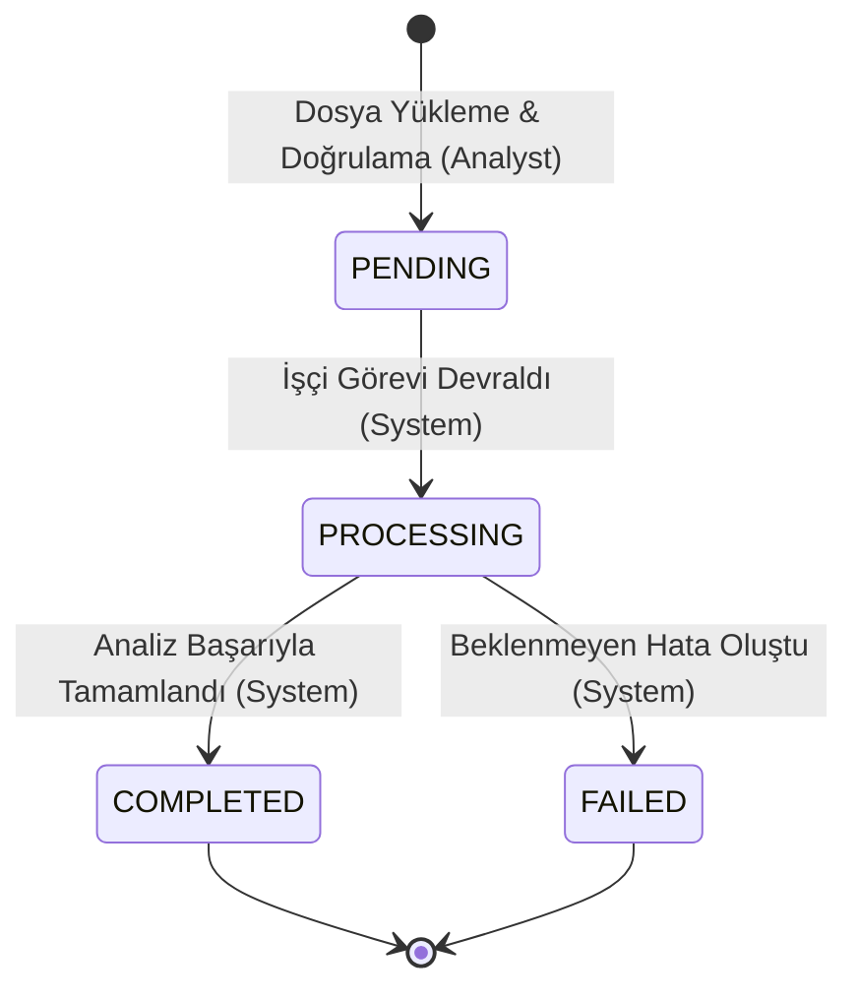
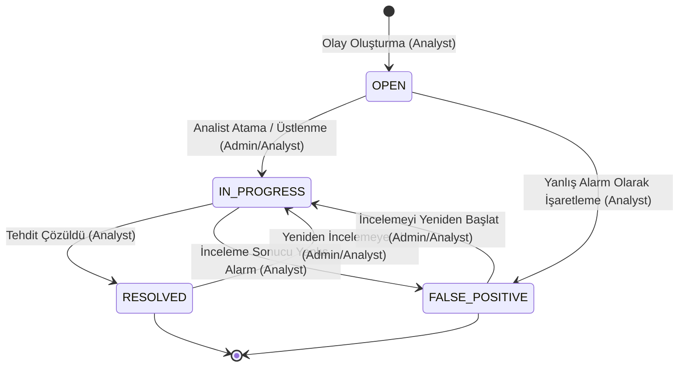

# SecureWatch AI — Durum Makineleri (State Machines)

Bu belge, SecureWatch AI projesindeki iki dinamik iş akışı olan **Analiz Süreci (AnalysisJob)** ve **Güvenlik Olayı (Incident)** nesnelerinin yaşam döngülerini, geçerli durumlarını ve durum geçiş kurallarını açıklar.

## 1. Giriş
Sistemdeki veri tutarlılığını korumak ve iş kurallarını işletmek amacıyla, belirli nesnelerin durum geçişleri katı kurallara bağlanmıştır. Bu kurallar backend servis katmanında doğrulanır.

---

## 2. Analiz Süreci (AnalysisJob) Durum Makinesi

`AnalysisJob` nesnesi, bir analist tarafından yüklenen ağ trafiği CSV dosyasının kuyruğa alınmasından tahmin sonuçlarının üretilmesine kadar geçen süreci yönetir.

### 2.1. Geçerli Durumlar
*   **`PENDING` (Beklemede):** Dosya sisteme başarıyla yüklenmiş, SHA-256 ve şema doğrulamalarından geçmiş ve arka plan analiz sırasına (Celery/Background Tasks) eklenmiştir.
*   **`PROCESSING` (İşleniyor):** Arka plan işçisi görevi devralmış, CSV dosyasını satır satır okumaya, veri ön işlemeye ve makine öğrenmesi tahmini yürütmeye başlamıştır.
*   **`COMPLETED` (Tamamlandı):** CSV dosyasındaki tüm satırlar başarıyla işlenmiş, risk skorları hesaplanmış ve `detection_results` tablosuna yazılmıştır.
*   **`FAILED` (Başarısız):** Dosya işleme sırasında herhangi bir hata (beklenmeyen veri formatı, bellek yetersizliği vb.) oluşmuştur. Hata detayları `error_message` alanına kaydedilmiştir.

### 2.2. Durum Geçiş Kuralları ve Tetikleyiciler

| Mevcut Durum | Hedef Durum | Tetikleyici Eylem | Yetki |
| :--- | :--- | :--- | :--- |
| **-** | `PENDING` | CSV dosyasının başarıyla yüklenmesi ve doğrulanması. | Analyst |
| `PENDING` | `PROCESSING` | Arka plan işçisinin kuyruktaki işi işleme almaya başlaması. | System (Worker) |
| `PROCESSING` | `COMPLETED` | Dosyadaki tüm akışların tahmin edilip veritabanına yazılması. | System (Worker) |
| `PROCESSING` | `FAILED` | İşleme esnasında sistemsel veya mantıksal bir hata oluşması. | System (Worker) |

### 2.3. Mermaid Durum Diyagramı

---

## 3. Güvenlik Olayı (Incident) Durum Makinesi

`Incident` nesnesi, riskli tespitlerden türetilen güvenlik olaylarının yaşam döngüsünü yönetir.

### 3.1. Geçerli Durumlar
*   **`OPEN` (Açık):** `HIGH` veya `CRITICAL` riskli bir tespit sonucundan olay oluşturulmuş, ancak henüz üzerinde çalışmaya başlanmamış ve atama yapılmamıştır.
*   **`IN_PROGRESS` (İncelemede):** Olay bir analiste atanmış (`assigned_analyst_id`) veya analist olayı kendi üzerine alarak inceleme sürecini başlatmıştır.
*   **`RESOLVED` (Çözüldü):** Analist tehdidin gerçek olduğunu doğrulamış, gerekli ağ ve sistem önlemlerini (örn. port kapatma, IP engelleme önerisi) almış ve tehdidi bertaraf etmiştir.
*   **`FALSE_POSITIVE` (Yanlış Alarm):** Analist yaptığı teknik inceleme sonucunda modelin tahmininin hatalı olduğunu (normal trafiğin saldırı olarak sınıflandırıldığını) tespit etmiş ve olayı bu statüyle kapatmıştır.

### 3.2. Durum Geçiş Kuralları ve Yetkiler

| Mevcut Durum | Hedef Durum | Geçiş Koşulu ve Açıklama | Yetki |
| :--- | :--- | :--- | :--- |
| **-** | `OPEN` | Analistin riskli bir tespit sonucundan güvenlik olayı oluşturması. | Analyst |
| `OPEN` | `IN_PROGRESS` | Yönetici tarafından olayın bir analiste atanması veya analistin olayı üstlenmesi. | Admin / Analyst |
| `IN_PROGRESS` | `RESOLVED` | Tehdit analizi ve mitigasyon adımlarının tamamlanması. | Admin / Analyst |
| `IN_PROGRESS` | `FALSE_POSITIVE` | İnceleme sonucu tespitin yanlış alarm olduğunun anlaşılması. | Admin / Analyst |
| `OPEN` | `FALSE_POSITIVE` | Doğrudan inceleme yapılmadan olayın yanlış alarm olarak işaretlenmesi. | Admin / Analyst |
| `RESOLVED` | `IN_PROGRESS` | Kapatılan olayda yeni şüpheli trafik veya bulgular tespit edilerek incelemenin yeniden açılması. | Admin / Analyst |
| `FALSE_POSITIVE` | `IN_PROGRESS` | Hatalı kapatıldığı düşünülen olayın tekrar incelemeye alınması. | Admin / Analyst |

### 3.3. Mermaid Durum Diyagramı

