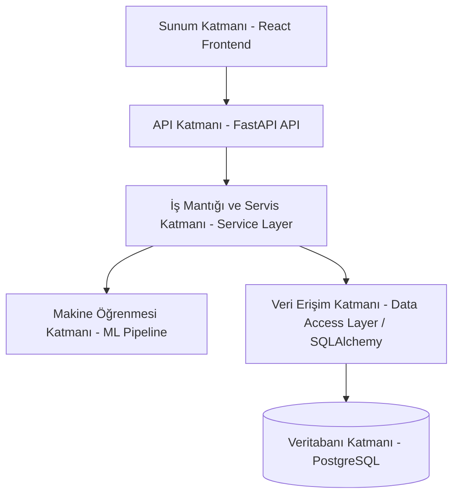
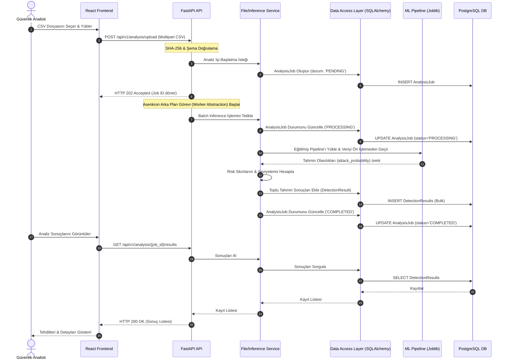

# SecureWatch AI — Sistem Mimarisi (System Architecture)

Bu belge, SecureWatch AI karar destek platformunun katmanlı mimari yapısını ve sistem bileşenleri arasındaki iletişim akışlarını ayrıntılandırır.

## 1. Katmanlı Mimari Genel Bakış
Uygulama; sürdürülebilirlik, ölçeklenebilirlik, test edilebilirlik ve sorumlulukların ayrılması (Separation of Concerns) ilkelerine uygun olarak **Katmanlı Mimari (Layered Architecture)** şablonuna göre tasarlanmıştır.

## 2. Varlık-İlişki ve Katman Bağımlılıkları Diyagramı
Aşağıdaki Mermaid diyagramı katmanları ve aralarındaki bağımlılık ilişkilerini göstermektedir:

### 1.1. Sunum Katmanı (Presentation Layer)
Kullanıcının sistemle etkileşime girdiği web arayüzüdür.
*   **React & TypeScript:** Güvenli, bileşen tabanlı, tip korumalı SPA (Single Page Application) mimarisi.
*   **Tailwind CSS:** Hızlı ve modern UI geliştirme, responsive tasarım.
*   **Recharts:** Dashboard üzerindeki görsel grafiklerin (saldırı dağılımları, risk eğilimleri vb.) dinamik çizimi.
*   **Axios / Fetch Client:** Backend REST API uç noktalarıyla JWT tabanlı kimlik doğrulama başlıkları kullanarak asenkron iletişim sağlar.

### 1.2. API Katmanı (Application / API Layer)
Sunum katmanından gelen istekleri karşılayan ve işleyen backend giriş noktasıdır.
*   **FastAPI:** Yüksek performanslı, asenkron (async/await destekli), otomatik OpenAPI/Swagger dokümantasyonu sunan Python web framework'ü.
*   **Routers:** İstekleri mantıksal modüllere (Auth, Users, Analysis, Incidents, Dashboard) yönlendirir.
*   **Dependency Injection (Bağımlılık Enjeksiyonu):** Veritabanı oturumlarını (`db_session`), kimlik doğrulama bağımlılıklarını (`get_current_user`) ve rol kontrollerini yönetir.

### 1.3. İş Mantığı ve Servis Katmanı (Service Layer)
Tüm iş kurallarının işletildiği, hesaplamaların yapıldığı ve operasyonel akışların yönetildiği katmandır.
*   **Auth Service:** Parola hashleme (bcrypt) ve JWT token üretme işlemlerini yönetir.
*   **File Upload & Validation Service:** Yüklenen CSV dosyalarının boyutunu, SHA-256 hash'ini ve CIC-IDS2017 sütun formatı doğruluğunu kontrol eder.
*   **Incident & Comment Service:** Tehditlerin olaya dönüştürülmesini, durum geçiş kurallarını ve yorum süreçlerini yönetir.
*   **Audit Logger Service:** Veritabanı işlemlerinden bağımsız olarak, güvenlik denetimi için eylemleri log tablosuna yazar.

### 1.4. Makine Öğrenmesi Katmanı (ML Layer)
Ön işleme adımlarını ve batch tahmin işlemlerini yürüten katmandır.
*   **Saved Pipeline (Joblib):** Çevrimdışı (offline) olarak eğitilen ve scikit-learn Pipeline nesnesi olarak kaydedilen modeli (Random Forest veya Logistic Regression) belleğe yükler.
*   **Batch Predictor:** Yüklenen CSV verilerini, eğitilmiş pipeline ön işleme aşamasından (imputing, scaling) geçirerek `attack_probability` değerlerini üretir.
*   **Risk Scorer:** Olasılık değerlerine göre risk skoru (0-100) ve provisional risk seviyelerini (`LOW`, `MEDIUM`, `HIGH`, `CRITICAL`) atar.

### 1.5. Veri Erişim ve Veritabanı Katmanı (Data Access & Database)
Verilerin kalıcı olarak saklandığı ve yönetildiği katmandır.
*   **SQLAlchemy ORM:** Python sınıflarını ilişkisel veritabanı tablolarıyla eşleştirir, SQL sorgularını güvenli ve SQL-injection korumalı hale getirir.
*   **Alembic:** Veritabanı şemasındaki değişikliklerin (migration) kontrollü ve sürüm geçmişi tutularak uygulanmasını sağlar.
*   **PostgreSQL:** Güvenilir, yüksek performanslı ve JSONB veri tipi desteği sunan ilişkisel veritabanı yönetim sistemi.

---

## 3. Bileşenler Arası İletişim Akışları

Sistemdeki kritik operasyonel akışların katmanlar ve bileşenler arasındaki geçiş sırası aşağıda Mermaid şemasıyla gösterilmiştir:

