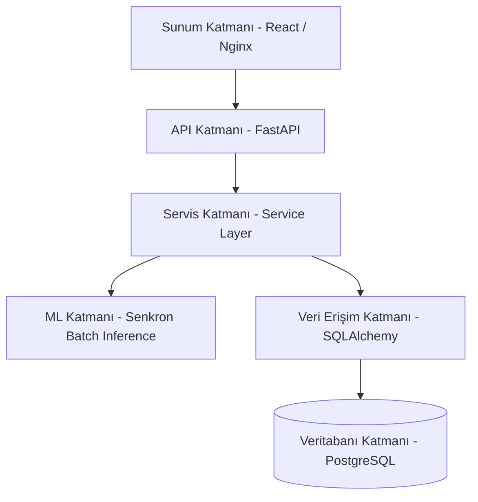
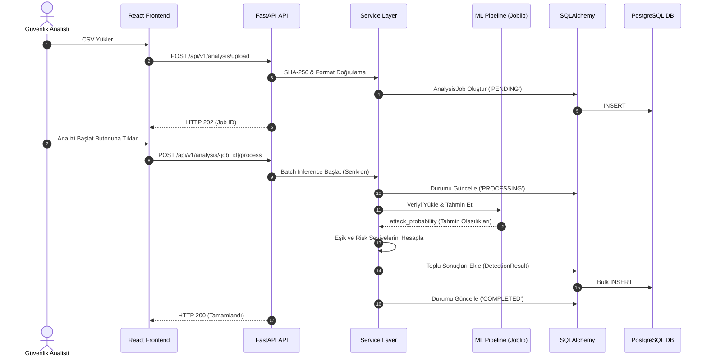

# SecureWatch AI — Sistem Mimarisi (System Architecture)

Bu belge, SecureWatch AI karar destek platformunun üretim ortamında (Docker) çalışan katmanlı mimari yapısını ve sistem bileşenleri arasındaki iletişim akışlarını ayrıntılandırır.

## 1. Katmanlı Mimari Genel Bakış
Uygulama; sürdürülebilirlik, ölçeklenebilirlik ve sorumlulukların ayrılması ilkelerine uygun olarak tasarlanmıştır.

### Varlık-İlişki ve Katman Bağımlılıkları Diyagramı

```mermaid
flowchart TD
    FE[Sunum Katmanı - React / Nginx] --> BE[API Katmanı - FastAPI]
    BE --> SVC[Servis Katmanı - Service Layer]
    SVC --> ML[ML Katmanı - Senkron Batch Inference]
    SVC --> DA[Veri Erişim Katmanı - SQLAlchemy]
    DA --> DB[(Veritabanı Katmanı - PostgreSQL)]
```

### 1.1. Sunum Katmanı (Presentation Layer)
Kullanıcının sistemle etkileşime girdiği web arayüzüdür.
*   **React & TypeScript:** Güvenli, bileşen tabanlı, tip korumalı SPA (Single Page Application) mimarisi.
*   **Vite & Nginx:** Geliştirme aşamasında Vite, üretim aşamasında ise yüksek performanslı Nginx web sunucusu ile statik dosyaların ve reverse-proxy yönlendirmelerinin yönetimi.
*   **Tailwind CSS:** Hızlı ve modern UI geliştirme, responsive tasarım.
*   **Recharts:** Dashboard üzerindeki görsel metriklerin dinamik çizimi.

### 1.2. API Katmanı (Application / API Layer)
Sunum katmanından gelen istekleri karşılayan backend giriş noktasıdır.
*   **FastAPI:** Yüksek performanslı, asenkron (async/await) Python web framework'ü.
*   **Routers:** İstekleri mantıksal modüllere (Auth, Users, Analysis, Incidents, Dashboard) yönlendirir.
*   **Dependency Injection:** Veritabanı oturumlarını (`db_session`), kimlik doğrulamayı (`get_current_user`) ve RBAC (rol tabanlı erişim) kontrollerini güvenle yönetir.

### 1.3. İş Mantığı ve Servis Katmanı (Service Layer)
Tüm iş kurallarının işletildiği, hesaplamaların yapıldığı operasyonel katmandır.
*   **Auth Service:** Parola hashleme (bcrypt) ve JWT token üretme işlemlerini yönetir.
*   **File Upload & Validation:** Yüklenen CSV dosyalarının boyutunu, SHA-256 hash'ini (mükerrerliği önlemek için) ve CIC-IDS2017 formatı doğruluğunu kontrol eder.
*   **Incident Service:** Analistlerin tehditleri güvenlik olayına dönüştürmesini, atamaları ve yorumları yönetir.

### 1.4. Makine Öğrenmesi Katmanı (ML Layer)
Ön işleme (preprocessing) adımlarını ve makine öğrenmesi tahminlerini senkron olarak yürüten katmandır.
*   **Saved Pipeline (Joblib):** Önceden eğitilmiş sızıntı korumalı (leakage-safe) scikit-learn Pipeline nesnesini (ön işleme ve tahmin edici modeli) yükler.
*   **Batch Predictor:** Yüklenen CSV verilerini pipeline üzerinden geçirerek `attack_probability` değerlerini senkron bir işlem olarak üretir.
*   **Risk Scorer:** Olasılık değerlerine göre risk seviyelerini (`LOW`, `MEDIUM`, `HIGH`, `CRITICAL`) atar.

### 1.5. Veri Erişim ve Veritabanı Katmanı (Data Access & Database)
*   **SQLAlchemy ORM:** Python sınıflarını tablolarla eşleştirir, SQL-injection korumalı hale getirir.
*   **Alembic:** Veritabanı şemasındaki değişikliklerin güvenle uygulanmasını sağlar.
*   **PostgreSQL:** Kalıcı verilerin ve ilişkilerin saklandığı veritabanı motoru.

---

## 2. Docker Deployment ve Ağ Mimarisi

Uygulama, üretim ortamı için Docker Compose ile konteynerize edilmiştir.

```mermaid
flowchart LR
    Host[Host Makinesi (Tarayıcı)] -->|HTTP :8080| Nginx[Frontend Konteyneri - Nginx]

    subgraph Docker Internal Network
        Nginx -->|Reverse Proxy /api/*| FastAPI[Backend Konteyneri - FastAPI :8000]
        FastAPI -->|TCP :5432| Postgres[(PostgreSQL Konteyneri)]
    end

    Uploads[(Uploads Volume)] --- FastAPI
    PGData[(PostgreSQL Veri Volume)] --- Postgres
```

**Güvenlik ve İzolasyon Notları:**
- Backend API (FastAPI) ve PostgreSQL veritabanı konteynerleri host makineye doğrudan açık değildir (portlar dışarıya bind edilmemiştir).
- Kullanıcılar sisteme yalnızca Frontend (Nginx) konteynerinin dışa açık 8080 portu üzerinden erişir; API istekleri Nginx tarafından backend konteynerine internal network üzerinden proxy (reverse proxy) edilir.
- Veritabanı verileri ve yüklenen pcap/csv dosyaları Docker named volume'leri ile kalıcı (persistent) hale getirilmiştir.

---

## 3. Bileşenler Arası İletişim Akışları

Sistemdeki analiz ve inference işlemleri **SENKRON** batch işleme prensibiyle çalışır. Harici bir worker kuyruğu (Celery, Redis vb.) bulunmamaktadır.

```mermaid
sequenceDiagram
    autonumber
    actor Analist as Güvenlik Analisti
    participant FE as React Frontend
    participant BE as FastAPI API
    participant SVC as Service Layer
    participant ML as ML Pipeline (Joblib)
    participant DA as SQLAlchemy
    participant DB as PostgreSQL DB

    Analist->>FE: CSV Yükler
    FE->>BE: POST /api/v1/analysis/upload
    BE->>SVC: SHA-256 & Format Doğrulama
    SVC->>DA: AnalysisJob Oluştur ('PENDING')
    DA->>DB: INSERT
    BE-->>FE: HTTP 202 (Job ID)

    Analist->>FE: Analizi Başlat Butonuna Tıklar
    FE->>BE: POST /api/v1/analysis/{job_id}/process
    BE->>SVC: Batch Inference Başlat (Senkron)
    SVC->>DA: Durumu Güncelle ('PROCESSING')
    SVC->>ML: Veriyi Yükle & Tahmin Et
    ML-->>SVC: attack_probability (Tahmin Olasılıkları)
    SVC->>SVC: Eşik ve Risk Seviyelerini Hesapla
    SVC->>DA: Toplu Sonuçları Ekle (DetectionResult)
    DA->>DB: Bulk INSERT
    SVC->>DA: Durumu Güncelle ('COMPLETED')
    BE-->>FE: HTTP 200 (Tamamlandı)
```

## 4. Kapsam ve Mimari Sınırlar
Sistem; tasarlanan ve uygulanan sınırları gereği aşağıdaki özellikleri **içermez**:
- **Gerçek Zamanlı Ağ Dinleme:** Sistem aktif bir IDS/IPS (Intrusion Detection System / Intrusion Prevention System) değildir; paketleri canlı olarak koklamaz (sniffing/pcap parsing yapmaz). Yalnızca formatlanmış CIC-IDS2017 CSV dosyalarını analiz eder.
- **Asenkron Message Queues (Celery/Redis vb.):** Dosya işleme (batch inference) süreleri kullanıcı kabulü dahilinde olduğundan işlemler senkron yürütülmektedir; arka planda görev dağıtan bir iş kuyruğu yapısı kullanılmamaktadır.
- **Cloud/Orchestration:** Uygulama tekil node üzerinde Docker Compose ile çalışacak şekilde optimize edilmiştir, Kubernetes veya dağıtık mikroservis mimarisine parçalanmamıştır.
