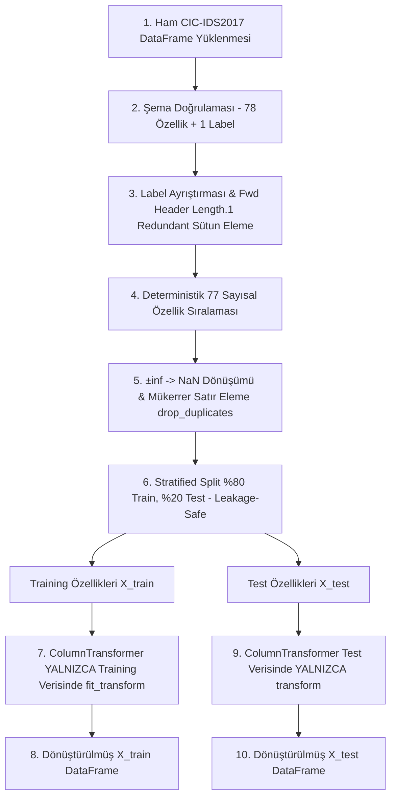

# SecureWatch AI — Makine Öğrenmesi Süreçleri (ML Training & Inference)

Bu belge, SecureWatch AI projesindeki ön işleme (preprocessing) pipeline'ını, ikili sınıflandırma etiket kodlamasını, baseline model eğitimini, performans metriklerini, uçtan uca CLI iş akışını, veri sızıntısını önleme kurallarını ve gelecek aşamaları tanımlar.

---

## 1. Giriş

Platform, ağ trafiği kayıtlarını normal (`BENIGN`) ve şüpheli/saldırı olarak sınıflandırmak için makine öğrenmesi yöntemlerini kullanır. Model başarısının doğruluğu ve güvenilirliği, verinin ön işleme adımlarının, etiket dönüşümünün ve veri sızıntısını (data leakage) önleyen mimarinin doğru kurulmasına bağlıdır.

---

## 2. Ön İşleme Pipeline'ı ve Veri Sızıntısını Önleme (Uygulanan Mimari — Gün 7)

Gün 7 kapsamında, model eğitimine giren verilerin hazırlanması, scikit-learn transformer katmanının oluşturulması ve veri sızıntısını (data leakage) tamamen engelleyen train/test ayrım servisi `app.services.preprocessing_service` altında geliştirilmiştir.



### 2.1. Eğitim Verisi Hazırlama (`prepare_training_data`)

Model eğitimi öncesinde verinin temizlenmesi ve standart biçime getirilmesi adımları:

1. **Şema Doğrulaması:** Ham DataFrame, canonical CIC-IDS2017 şemasına (`CICIDS2017_FEATURE_COLUMNS`, 78 özellik) göre doğrulanır. Eksik veya fazla özellik varlığında `SCHEMA_MISMATCH` (422) hatası üretilir.
2. **Hedef Değişken (`Label`) Ayrımı:** Yükleme aşamasında opsiyonel olan `Label` sütunu, model eğitimi verisi hazırlanırken **zorunludur**. Eksik veya boş etiketler reddedilir. `Label` sütunu özellik matrisinden ayrılır.
3. **Redundant Özellik Eleme:** CIC-IDS2017 şemasında mükerrer kayıtlı `Fwd Header Length.1` sütunu, şema doğrulamasından **sonra** özellik matrisinden düşürülür.
4. **Model Özellik Sayısı ve Sıralaması:** Model girdisi, `REDUNDANT_COLUMN` çıkarıldıktan sonra tam olarak **77 sayısal özellikten** oluşur ve sıralama deterministiktir.
5. **Sayısal Özellikler ve `Destination Port`:** `Destination Port` dahil 77 özelliğin tamamı sayısal veri tipine dönüştürülür (`pd.to_numeric`). `Destination Port` varsayılan yapıda kategorik sütun olarak zorlanmaz; diğer özelliklerle birlikte sayısal pipeline'a dahil edilir.
6. **Infinity ve Eksik Değer İşleme:** Pozitif ve negatif sonsuz (`+inf`, `-inf`) değerler `NaN` değerine dönüştürülür.
7. **Mükerrer Satır Temizliği:** Overfitting'i önlemek amacıyla tam mükerrer (exact duplicate) satırlar train/test split işleminden **önce** (`drop_duplicates()`) kaldırılır.

### 2.2. Scikit-Learn Ön İşleme Transformer'ı (`build_sklearn_preprocessing_pipeline`)

Özelliklerin imputer ve scaler katmanlarından geçirilmesi için esnek ve unfitted scikit-learn `ColumnTransformer` builder'ı oluşturulmuştur:

- **Sayısal Pipeline (`num`):** `SimpleImputer(strategy="median", keep_empty_features=True)` → `StandardScaler()`. Medyan imputer ile eksik veriler doldurulur, ardından ortalaması 0 ve varyansı 1 olacak şekilde ölçeklenir. `keep_empty_features=True` sayesinde tamamen NaN olan sütunlar çıktı matrisinden kaybolmaz.
- **Varsayılan Yapı:** 77 sayısal özellik, 0 kategorik özellik içerir.
- **Opsiyonel Kategorik Desteği (`cat`):** `SimpleImputer(strategy="most_frequent", keep_empty_features=True)` → `OneHotEncoder(handle_unknown="ignore", sparse_output=False)`. İleride eklenebilecek kategorik alanlar için en sık tekrarlanan değerle doldurma ve bilinmeyen kategorileri sessizce yoksayma (`handle_unknown="ignore"`) desteği mevcuttur.
- **Doğrulamalar:** Sayısal ve kategorik sütun listelerinde çakışma (overlap), mükerrer sütun adı veya boş sütun adı olması durumunda `VALIDATION_ERROR` (422) fırlatılır.
- **Unfitted Nesne Garantisi:** Builder fonksiyonu her çağrıda bağımsız, eğitilmemiş (unfitted) ve klonlanabilir (`sklearn.base.clone`) bir `ColumnTransformer(remainder="drop")` nesnesi döndürür.

### 2.3. Veri Sızıntısını Önleyen Train/Test Ayrımı (`split_and_transform_data`)

Model değerlendirmesinin güvenilirliği için veri sızıntısı (data leakage) tam olarak engellenmiştir:

- **Fit Öncesi Split:** Train/test ayrımı, transformer `fit` edilmeden **önce** gerçekleştirilir.
- **Varsayılan Bölme:** `test_size=0.2`, `random_state=42` ve etiket dağılımını koruyan `stratify=data.targets` kullanır.
- **Katı Stratification Kuralı:** Stratified split başarısız olursa (örneğin veri setinde < 2 sınıf bulunması veya herhangi bir sınıfta < 2 örnek olması durumunda) sessizce normal split'e **düşülmez**; açıkça `VALIDATION_ERROR` (422) hatası verilir.
- **Eğitim Setinde `fit_transform`:** Transformer **yalnızca** eğitim verisi (`X_train`) üzerinde `fit_transform()` edilerek imputer medyanı ve scaler ortalama/standart sapma istatistikleri öğrenilir.
- **Test Setinde YALNIZCA `transform`:** Test verisi (`X_test`) üzerinde asla `fit` veya `fit_transform` çağrılmaz; yalnızca eğitilmiş transformer üzerinden `transform()` çalıştırılır. Test kümesindeki aykırı değerler (outlier) veya eksik veriler eğitim istatistiklerini değiştiremez.
- **Deterministik ve Ayrık İndeksler:** Training ve test indeksleri kesişmez (`train_indices ∩ test_indices = ∅`) ve toplam satır sayısını tam kapsar. İndeksler immutable Python `tuple` tipinde saklanır.
- **Defensive Copy (Derin Kopya) Yalıtımı:** `split_and_transform_data` fonksiyonu giriş `TrainingDataResult` verisinin ve çıktı `X_train`/`X_test`/`y_train`/`y_test` DataFrames/Series nesnelerinin bağımsız derin kopyalarını (`copy(deep=True)`) oluşturur. Çağrıcıların mutable pandas buffer'larını değiştirmesi durumunda kaynak veri veya diğer küme etkilenmez.

---

## 3. İkili Etiket Kodlaması ve Baseline Model Eğitimi (Uygulanan Mimari — Gün 8)

Gün 8 kapsamında ikili etiket kodlaması servisi, baseline performans metrikleri altyapısı, `DummyClassifier` ve `LogisticRegression` modelleri, uçtan uca eğitim iş akışı ve CLI betiği `app.services.model_service` ve `scripts.train_baseline_models` altında geliştirilmiştir.

### 3.1. İkili Saldırı Etiketi Kodlama (`encode_binary_labels`)

CIC-IDS2017 veri setindeki metin tabanlı `Label` değerlerini ikili sınıflandırma hedefine (`0` ve `1`) dönüştürür:

- **Zorunlu Label Varlığı:** `Label` sütunundaki metinler temizlenir (whitespace stripping ve büyük harfe dönüştürme).
- **`BENIGN → 0`:** Normal trafik etiketleri ikili `0` sınıfına atanır.
- **Saldırı Trafigi → `1`:** `BENIGN` dışındaki tüm geçerli saldırı etiketleri ikili `1` sınıfına atanır.
- **Doğrulamalar:** Boş Series, NaN/None içeren Series, metin dışı değerler veya boş dize barındıran Series durumunda `VALIDATION_ERROR` (422) üretilir.
- **Sıralama Garantisi:** Etiket kodlaması, stratified split işleminden **önce** gerçekleştirilir. Stratification ham saldırı metinleri üzerinden değil, ikili `0/1` etiketleri üzerinden yapılır.

### 3.2. Baseline Sınıflandırıcılar (`train_dummy_classifier` & `train_logistic_regression`)

#### 3.2.1. DummyClassifier Baseline (`train_dummy_classifier`)
- **Hiperparametreler:** `strategy="most_frequent"`, `random_state=42`
- **Amaç:** Eğitim verisindeki en sık gözlenen sınıfa göre sabit tahmin üreten en alt referans çizgisidir. Model seçimi amacıyla kullanılmaz.
- **Eğitim & Değerlendirme:** Yalnızca `X_train`/`y_train` üzerinde `fit` edilir, yalnızca `X_test` üzerinde tahmin yürütür.

#### 3.2.2. Logistic Regression Baseline (`train_logistic_regression`)
- **Hiperparametreler:** `class_weight="balanced"` (varsayılan), `max_iter=1000`, `solver="lbfgs"`, `random_state=42`
- **Esnek Sınıf Ağırlığı Desteği:** `"balanced"`, `None` veya özel sözlük `{0: weight_for_0, 1: weight_for_1}` desteklenir. Sözlük anahtarlarının tam olarak `0` ve `1` olması, değerlerin pozitif ve sonlu sayılar olması zorunludur (0, negatif, NaN, inf, bool veya string değerler `VALIDATION_ERROR` 422 ile reddedilir).
- **Eğitim & Değerlendirme:** Yalnızca `X_train`/`y_train` üzerinde `fit` edilir, `X_test` üzerinde tahmin yürütür. `y_test` hedefleri fit aşamasına kesinlikle sızdırılmaz. Katsayı boyutu (`coef_`) 77 sayısal özellik boyutuyla tam eşleşir.

### 3.3. Sınıflandırma Performans Metrikleri (`evaluate_binary_classification`)

İkili sınıflandırma tahminlerini değerlendirmek üzere immutable `ClassificationMetrics` yapısını döndürür:

- **Hedef Sınıflar:** Pozitif sınıf = `1` (Saldırı), Negatif sınıf = `0` (`BENIGN`).
- **Hesaplanan Metrikler:** Accuracy, Precision, Recall, F1-Score.
- **Sıfır Bölme Güvenliği:** Precision, Recall ve F1 hesaplamalarında `zero_division=0` kullanılarak uyarı (warning) üretilmesi engellenmiştir.
- **Confusion Matrix Düzeni:** Metrik raporlarında karmaşıklık matrisi sırası `[[TN, FP], [FN, TP]]` olarak belirlenmiştir.
- **2x2 Matris Garantisi:** Test verisinde tek bir sınıf bulunsa dahi karmaşıklık matrisi 2x2 boyutunda üretilir.

### 3.4. Uçtan Uca Eğitim İş Akışı (`train_baseline_models`)

Bütün ön işleme ve model eğitimi adımlarını sırasıyla çalıştıran public fonksiyondur:

1. `prepare_training_data(df)` ile şema ve veri doğrulaması yapılır.
2. `encode_binary_labels(...)` ile ham etiketler ikili `0/1` hedefe dönüştürülür.
3. İkili hedef içeren bağımsız `TrainingDataResult` oluşturulur.
4. `build_sklearn_preprocessing_pipeline()` ile unfitted preprocessor hazırlanır.
5. `split_and_transform_data(...)` ile leakage-safe train/test ayrımı yapılır.
6. `train_dummy_classifier(...)` çalıştırılır.
7. `train_logistic_regression(..., class_weight="balanced")` çalıştırılır.
8. Metrikler ve sınıf dağılımları `BaselineTrainingReport` olarak döndürülür.

### 3.5. Eğitim CLI Betiği (`scripts.train_baseline_models`)

Backend dizininden aşağıdaki komutla çalıştırılabilir:

```bash
python -m scripts.train_baseline_models --input path/to/training.csv
```

- **Girdi Kontrolü:** `--input` parametresi zorunludur; dosya uzantısının `.csv` olduğunu ve varlığını doğrular.
- **Çıktı Formatı:** Başarılı çalışmada JSON raporunu stdout'a yazar (`allow_nan=False`).
- **Hata Yönetimi:** Geçersiz dosya, şema veya eğitim hatasında sıfırdan farklı bir exit code ile stderr'e kısa ve güvenli bir hata mesajı basar (asla traceback, veri satırları veya mutlak yerel yollar basmaz).
- **Güvenlik & İzolasyon:** Kalıcı model dosyası, Joblib artifact'i veya diske rapor dosyası yazmaz. Tahmin dizisi rapora sızdırılmaz (en fazla 10 elemanlık `prediction_sample` sunulur).

---

## 4. Gelecek Aşamalar (Henüz Uygulanmayan Özellikler)

Aşağıdaki bileşenler Gün 8 itibarıyla **uygulanmamıştır** ve sonraki günlerin geliştirme planında yer almaktadır:

- **RandomForestClassifier:** Karmaşık ve non-linear ilişkileri yakalayan gelişmiş sınıflandırıcı.
- **Kontrollü Parametre Denemeleri & Feature Importance:** Özellik önem derecelerinin çıkarılması.
- **Gelişmiş Değerlendirme:** ROC-AUC, Precision-Recall Eğrisi ve False Positive Rate (FPR) analizi.
- **Model Seçimi:** Baseline ve gelişmiş modellerin karşılaştırılıp nihai modelin seçilmesi.
- **Risk Eşiklerinin Kesinleştirilmesi:** İş gereksinimlerine göre FPR/FNR tolerans sınırlarının ayarlanması.
- **Model Kartı (Model Card):** Model performans, limitasyon ve eğitim detaylarının dokümantasyonu.
- **Joblib Model Persistence:** Preprocessor ve eğitilmiş modelin `.joblib` formatında diske kaydedilmesi.
- **Asenkron Batch Inference:** Yüklenen CSV analiz işlerinin background worker tarafından tahmin edilmesi.

---

## 5. Risk Skorlama ve Eşik (Threshold) Yönetimi

Modelin ürettiği saldırı olasılığı (`p`), risk skoru ve risk seviyelerine aşağıdaki kuralla dönüştürülür:

$$\text{Risk Skoru} = \text{round}(p \times 100)$$

### 5.1. Başlangıç (Provisional) Risk Eşikleri

| Risk Seviyesi (`risk_level`) | Risk Skoru Aralığı | Açıklama |
| :--- | :--- | :--- |
| **`LOW`** (Düşük) | 0 – 30 | Normal trafik, analistin aksiyon alması gerekmez. |
| **`MEDIUM`** (Orta) | 31 – 60 | Şüpheli akış, analist detayları inceleyebilir. |
| **`HIGH`** Yüksek | 61 – 85 | Yüksek saldırı olasılığı, güvenlik olayına dönüştürülebilir. |
| **`CRITICAL`** (Kritik) | 86 – 100 | Kritik tehdit tespiti, analist tarafından güvenlik olayına dönüştürülmesi önerilir. |

> [!WARNING]
> Bu eşik değerleri geçicidir. **Kesin eşik sınırları, Gün 10'da gerçekleştirilecek olan precision-recall dengesi, False Positive Rate (FPR) toleransı ve iş gereksinimleri değerlendirmesi sonrasında belirlenecektir.**
