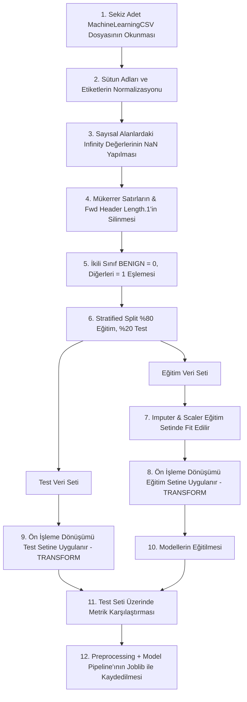

# SecureWatch AI — Makine Öğrenmesi Süreçleri (ML Training & Inference)

Bu belge, SecureWatch AI projesindeki çevrimdışı (offline) model eğitimi, sürümleme standartları, veri sızıntısını önleme kuralları ve CSV tabanlı batch tahmin (inference) akışlarını tanımlar.

## 1. Giriş
Platform, ağ trafiği kayıtlarını normal ve şüpheli olarak sınıflandırmak için makine öğrenmesi yöntemlerini kullanır. Model başarısının doğruluğu ve güvenilirliği, verinin ön işleme adımlarının doğru şekilde sıralanmasına bağlıdır.

---

## 2. ML Eğitim Akışı ve Veri Sızıntısını Önleme (Data Leakage Prevention)

Eğitim sürecinde test verilerinin eğitim modellerine sızmasını (data leakage) engellemek amacıyla adımlar aşağıdaki sıralamayla uygulanacaktır:

### 2.1. Eğitim Adımları Detayları
1.  **Veri Keşfi:** `data/raw/` altında bulunan 8 resmî MachineLearningCSV dosyası belleğe chunking yöntemiyle yüklenir.
2.  **Etiket Normalizasyonu:** Sütun isimlerindeki boşluklar temizlenir (`strip`). Label sütunundaki metinsel hatalar (büyük/küçük harf, encoding anomalileri) normalize edilerek standartlaştırılır.
3.  **Infinity Temizliği:** Sayısal sütunlarda yer alan `Infinity` değerleri, sonraki aşamada doldurulabilmesi amacıyla `NaN` (Not a Number) değerlerine dönüştürülür.
4.  **Mükerrerlik ve Tekrarlı Sütun Eleme:** Overfitting'i önlemek için mükerrer satırlar silinir. Aynı bilgiyi taşıyan mükerrer `Fwd Header Length.1` sütunu veri setinden düşürülür.
5.  **İkili Hedef Değişken Eşlemesi:** `Label` sütununda `BENIGN` içeren kayıtlar `0` (Normal), diğer tüm saldırı türleri (DDoS, PortScan, Bot vb.) `1` (Saldırı) olarak işaretlenir.
6.  **Stratified Veri Bölme (Split):** Sınıf dengesizliği koruyacak şekilde veri seti %80 Eğitim, %20 Test olacak şekilde stratified yöntemle bölünür.
7.  **Ön İşleme Fit Kuralı:** Imputer (Eksik veri tamamlama - median) ve Scaler (Sayısal ölçeklendirme) gibi istatistik öğrenen tüm dönüştürücüler **yalnızca eğitim veri seti üzerinde fit edilir (`fit_transform`)**.
8.  **Ön İşleme Transform Kuralı:** Fit edilen bu dönüştürücüler test veri setine sadece uygulanır (`transform`). Test verisinin istatistikleri (ortalama, standart sapma, median) asla ön işleme parametrelerini etkilememelidir.
9.  **Baseline Modeli:** Model değerlendirmelerine temel oluşturması amacıyla en basit tahminleri yürüten `DummyClassifier` eğitilir.
10. **Modelleme:** Ön işleme katmanından geçen eğitim verileriyle `Logistic Regression` ve `Random Forest` algoritmaları eğitilir.
11. **Karşılaştırma:** Test seti üzerinde tahminler yürütülerek modeller; `precision`, `recall`, `F1-Score`, `ROC-AUC`, `FPR` (False Positive Rate) ve `confusion matrix` metriklerine göre karşılaştırılır.
12. **Bütünsel Pipeline Kaydı:** Seçilen en başarılı ön işleme transformatörleri ve sınıflandırıcı model, tek bir scikit-learn `Pipeline` nesnesi olarak paketlenip **Joblib** formatında disk üzerine kaydedilir.
13. **Model Kartı:** Kaydedilen model; sürüm bilgisi (örn: `v1.0.0`), girdi özellikleri şeması ve elde ettiği metriklerle birlikte belgelenerek kayıt altına alınır.

---

## 3. CSV Tabanlı Batch Tahmin (Inference) Akışı

> **ÖNEMLİ:** SecureWatch AI, canlı ağ trafiğini dinleyen veya PCAP paketlerini koklayan (sniffing) gerçek zamanlı bir IDS/IPS değildir. Tamamen web arayüzünden yüklenen CSV dosyaları üzerinden çalışan asenkron bir **MVP karar destek prototipidir**.

### 3.1. Batch Tahmin Yaşam Döngüsü Adımları
1.  **CSV Yükleme:** Güvenlik Analisti, web arayüzünü kullanarak ağ trafiği verilerini barındıran CSV dosyasını sisteme yükler.
2.  **Şema Doğrulama:** Backend servisleri dosyanın boyut sınırlarını ve CIC-IDS2017 şemasına (78 özellik sütunu zorunlu, Label sütunu ise opsiyonel olacak şekilde) uyumluluğunu doğrular.
3.  **Kuyruğa Ekleme:** Doğrulama başarılı olursa veritabanında `PENDING` durumunda bir `AnalysisJob` oluşturulur ve istemciye HTTP 202 kabul yanıtı verilir.
4.  **İşlem Başlatma:** Arka planda çalışan işçi (Background Task) görevi devralarak iş durumunu `PROCESSING` olarak günceller.
5.  **Ön İşleme ve Tahmin:** Kaydedilmiş olan Joblib pipeline dosyası yüklenir. CSV'deki her bir satır pipeline'dan geçirilerek model tarafından saldırı olasılığı (`attack_probability`) hesaplanır.
6.  **Risk Skorlama:** Üretilen olasılık değeri (0.0 - 1.0) temel alınarak risk skoru (0 - 100) ve risk seviyesi (`LOW`, `MEDIUM`, `HIGH`, `CRITICAL`) hesaplanır.
7.  **Veritabanı Kaydı:** Tahmin sonuçları, orijinal özellik snapshot'ları (JSONB) ile birlikte toplu (bulk insert) olarak `detection_results` tablosuna yazılır.
8.  **İş Tamamlama:** Tüm satırlar başarıyla işlendiğinde `AnalysisJob` durumu `COMPLETED` olarak işaretlenir. Süreçte kritik bir hata alınırsa durum `FAILED` yapılır.

---

## 4. Risk Skorlama ve Eşik (Threshold) Yönetimi

Modelin ürettiği saldırı olasılığı (`p`), risk skoru ve risk seviyelerine aşağıdaki kuralla dönüştürülür:

$$\text{Risk Skoru} = \text{round}(p \times 100)$$

### 4.1. Başlangıç (Provisional) Risk Eşikleri

Aşağıdaki seviyeler geliştirme aşaması için belirlenmiş başlangıç değerleridir:

| Risk Seviyesi (`risk_level`) | Risk Skoru Aralığı | Açıklama |
| :--- | :--- | :--- |
| **`LOW`** (Düşük) | 0 – 30 | Normal trafik, analistin aksiyon alması gerekmez. |
| **`MEDIUM`** (Orta) | 31 – 60 | Şüpheli akış, analist detayları inceleyebilir. |
| **`HIGH`** (Yüksek) | 61 – 85 | Yüksek saldırı olasılığı, güvenlik olayına dönüştürülebilir. |
| **`CRITICAL`** (Kritik) | 86 – 100 | Kritik tehdit tespiti, analist tarafından güvenlik olayına dönüştürülmesi önerilir. |

> [!WARNING]
> Bu eşik değerleri geçicidir. **Kesin eşik sınırları, Gün 10'da gerçekleştirilecek olan precision-recall dengesi, False Positive Rate (FPR) toleransı ve iş gereksinimleri değerlendirmesi sonrasında belirlenecektir.**
