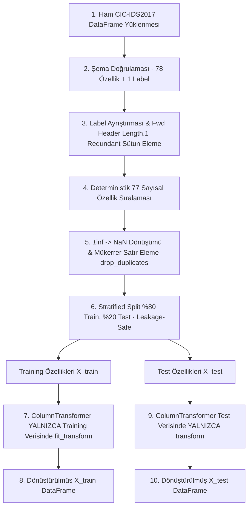

# SecureWatch AI — Makine Öğrenmesi Süreçleri (ML Training & Inference)

Bu belge, SecureWatch AI projesindeki ön işleme (preprocessing) pipeline'ını, çevrimdışı (offline) model eğitimi standartlarını, veri sızıntısını önleme kurallarını ve CSV tabanlı batch tahmin (inference) akışlarını tanımlar.

---

## 1. Giriş

Platform, ağ trafiği kayıtlarını normal ve şüpheli olarak sınıflandırmak için makine öğrenmesi yöntemlerini kullanır. Model başarısının doğruluğu ve güvenilirliği, verinin ön işleme adımlarının ve veri sızıntısını (data leakage) önleyen mimarinin doğru kurulmasına bağlıdır.

---

## 2. Ön İşleme Pipeline'ı ve Veri Sızıntısını Önleme (Uygulanan Mimari — Gün 7)

Gün 7 kapsamında, model eğitimine giren verilerin hazırlanması, scikit-learn transformer katmanının oluşturulması ve veri sızıntısını (data leakage) tamamen engelleyen train/test ayrım servisi `app.services.preprocessing_service` altında geliştirilmiştir.

### 2.1. Eğitim Verisi Hazırlama (`prepare_training_data`)

Model eğitimi öncesinde verinin temizlenmesi ve standart biçime getirilmesi adımları:

1. **Şema Doğrulaması:** Ham DataFrame, canonical CIC-IDS2017 şemasına (`CICIDS2017_FEATURE_COLUMNS`, 78 özellik) göre doğrulanır. Eksik veya fazla özellik varlığında `SCHEMA_MISMATCH` (422) hatası üretilir.
2. **Hedef Değişken (`Label`) Ayrımı:** Yükleme aşamasında opsiyonel olan `Label` sütunu, model eğitimi verisi hazırlanırken **zorunludur**. Eksik veya boş etiketler reddedilir. `Label` sütunu özellik matrisinden ayrılır.
3. **Redundant Özellik Eleme:** CIC-IDS2017 şemasında mükerrer kayıtlı `Fwd Header Length.1` sütunu, şema doğrulamasından **sonra** özellik matrisinden düşürülür.
4. **Model Özellik Sayısı ve Sıralaması:** Model girdisi, `REDUNDANT_COLUMN` çıkarıldıktan sonra tam olarak **77 sayısal özellikten** oluşur ve sıralama deterministiktir.
5. **Sayısal Özellikler ve `Destination Port`:** `Destination Port` dahil 77 özelliğin tamamı sayısal veri tipine dönüştürülür (`pd.to_numeric`). `Destination Port` varsayılan yapıda kategorik sütun olarak zorlanmaz; diğer özelliklerle birlikte sayısal pipeline'a dahil edilir.
6. **Infinity ve Eksik Değer İşleme:** Pozitif ve negatif sonsuz (`+inf`, `-inf`) değerler `NaN` değerine dönüştürülür.
7. **Mükerrer Satır Temizliği:** Overfitting'i önlemek amacıyla tam mükerrer (exact duplicate) satırlar train/test split işleminden **önce** (`drop_duplicates()`) kaldırılır.
8. **Hedef Değişken Durumu:** `Label` değerleri Gün 7 aşamasında metin (string) olarak korunur; etiket kodlaması (label encoding) henüz uygulanmamıştır.

### 2.2. Scikit-Learn Ön İşleme Transformer'ı (`build_sklearn_preprocessing_pipeline`)

Özelliklerin imputer ve scaler katmanlarından geçirilmesi için esnek ve unfitted scikit-learn `ColumnTransformer` builder'ı oluşturulmuştur:

- **Sayısal Pipeline (`num`):** `SimpleImputer(strategy="median", keep_empty_features=True)` → `StandardScaler()`. Medyan imputer ile eksik veriler doldurulur, ardından ortalaması 0 ve varyansı 1 olacak şekilde ölçeklenir. `keep_empty_features=True` sayesinde tamamen NaN olan sütunlar çıktı matrisinden kaybolmaz.
- **Varsayılan Yapı:** 77 sayısal özellik, 0 kategorik özellik içerir.
- **Opsiyonel Kategorik Desteği (`cat`):** `SimpleImputer(strategy="most_frequent", keep_empty_features=True)` → `OneHotEncoder(handle_unknown="ignore", sparse_output=False)`. İleride eklenebilecek kategorik alanlar için en sık tekrarlanan değerle doldurma ve bilinmeyen kategorileri sessizce yoksayma (`handle_unknown="ignore"`) desteği mevcuttur.
- **Doğrulamalar:** Sayısal ve kategorik sütun listelerinde çakışma (overlap), mükerrer sütun adı veya boş sütun adı olması durumunda `VALIDATION_ERROR` (422) fırlatılır.
- **Unfitted Nesne Garantisi:** Builder fonksiyonu her çağrıda bağımsız, eğitilmemiş (unfitted) ve klonlanabilir (`sklearn.base.clone`) bir `ColumnTransformer(remainder="drop")` nesnesi döndürür.

### 2.3. Veri Sızıntısını Önleyen Train/Test Ayrımı (`split_and_transform_data`)

Model değerlendirmesinin güvenilirliği için veri sızıntısı (data leakage) tam olarak engellenmiştir:

- **Fit Öncesi Split:** Train/test ayrımı, transformer `fit` edilmeden **önce** gerçekleştirilir.
- **Varsayılan Bölme:** `test_size=0.2`, `random_state=42` ve etiket dağılımını koruyan `stratify=data.targets` kullanır.
- **Katı Stratification Kuralı:** Stratified split başarısız olursa (örneğin veri setinde < 2 sınıf bulunması veya herhangi bir sınıfta < 2 örnek olması durumunda) sessizce normal split'e **düşülmez**; açıkça `VALIDATION_ERROR` (422) hatası verilir.
- **Eğitim Setinde `fit_transform`:** Transformer **yalnızca** eğitim verisi (`X_train`) üzerinde `fit_transform()` edilerek imputer medyanı ve scaler ortalama/standart sapma istatistikleri öğrenilir.
- **Test Setinde YALNIZCA `transform`:** Test verisi (`X_test`) üzerinde asla `fit` veya `fit_transform` çağrılmaz; yalnızca eğitilmiş transformer üzerinden `transform()` çalıştırılır. Test kümesindeki aykırı değerler (outlier) veya eksik veriler eğitim istatistiklerini değiştiremez.
- **Deterministik ve Ayrık İndeksler:** Training ve test indeksleri kesişmez (`train_indices ∩ test_indices = ∅`) ve toplam satır sayısını tam kapsar. İndeksler immutable Python `tuple` tipinde saklanır.
- **Defensive Copy (Derin Kopya) Yalıtımı:** `split_and_transform_data` fonksiyonu giriş `TrainingDataResult` verisinin ve çıktı `X_train`/`X_test`/`y_train`/`y_test` DataFrames/Series nesnelerinin bağımsız derin kopyalarını (`copy(deep=True)`) oluşturur. Çağrıcıların mutable pandas buffer'larını değiştirmesi durumunda kaynak veri veya diğer küme etkilenmez.

---

## 3. Gelecek Aşamalar (Henüz Uygulanmayan Özellikler)

Aşağıdaki bileşenler Gün 7 kapsamında **uygulanmamıştır** ve sonraki günlerin (Gün 8+) geliştirme planında yer almaktadır:

- **Etiket Kodlaması (Label Encoding):** `BENIGN` → `0`, Saldırı türleri → `1` ikili etiket dönüşümü.
- **Model Eğitimi & Sınıflandırıcılar:** Baseline `DummyClassifier`, `LogisticRegression` ve `RandomForestClassifier` modellerinin eğitilmesi.
- **Model Seçimi ve Değerlendirme:** Precision, Recall, F1-Score, ROC-AUC ve Confusion Matrix metrikleriyle model karşılaştırması.
- **Joblib Model Persistence:** Preprocessor ve eğitilmiş modelin tek bir scikit-learn `Pipeline` olarak `.joblib` formatında diske kaydedilmesi.
- **Asenkron Batch Inference:** Web arayüzünden yüklenen CSV analiz işlerinin background worker tarafından `.joblib` modeli kullanılarak tahmin edilmesi ve veritabanına kaydedilmesi.

---

## 4. Risk Skorlama ve Eşik (Threshold) Yönetimi

Modelin ürettiği saldırı olasılığı (`p`), risk skoru ve risk seviyelerine aşağıdaki kuralla dönüştürülür:

$$\text{Risk Skoru} = \text{round}(p \times 100)$$

### 4.1. Başlangıç (Provisional) Risk Eşikleri

| Risk Seviyesi (`risk_level`) | Risk Skoru Aralığı | Açıklama |
| :--- | :--- | :--- |
| **`LOW`** (Düşük) | 0 – 30 | Normal trafik, analistin aksiyon alması gerekmez. |
| **`MEDIUM`** (Orta) | 31 – 60 | Şüpheli akış, analist detayları inceleyebilir. |
| **`HIGH`** (Yüksek) | 61 – 85 | Yüksek saldırı olasılığı, güvenlik olayına dönüştürülebilir. |
| **`CRITICAL`** (Kritik) | 86 – 100 | Kritik tehdit tespiti, analist tarafından güvenlik olayına dönüştürülmesi önerilir. |

> [!WARNING]
> Bu eşik değerleri geçicidir. **Kesin eşik sınırları, Gün 10'da gerçekleştirilecek olan precision-recall dengesi, False Positive Rate (FPR) toleransı ve iş gereksinimleri değerlendirmesi sonrasında belirlenecektir.**
