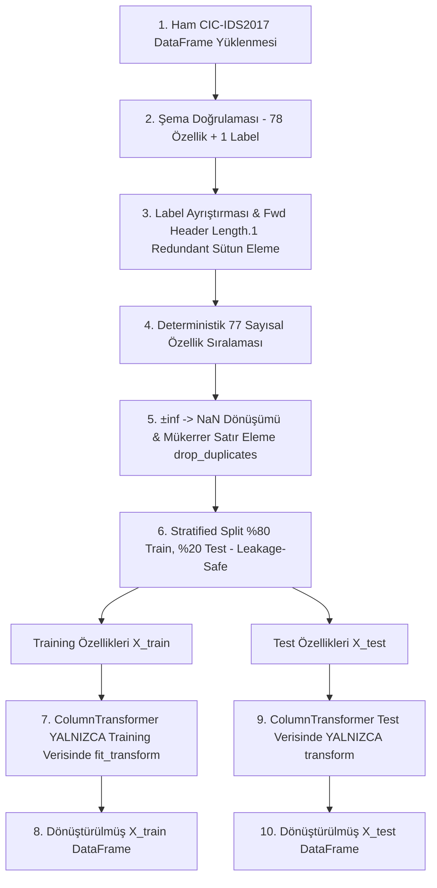

# SecureWatch AI — Makine Öğrenmesi Süreçleri (ML Training & Inference)

Bu belge, SecureWatch AI projesindeki ön işleme (preprocessing) pipeline'ını, ikili sınıflandırma etiket kodlamasını, model eğitimi altyapısını, veri sızıntısını önleme kurallarını ve toplu (batch) inference iş akışını tanımlar.

---

## 1. Giriş

Platform, ağ trafiği kayıtlarını normal (`BENIGN`) ve şüpheli/saldırı olarak sınıflandırmak için makine öğrenmesi yöntemlerini kullanır. Model başarısının doğruluğu ve güvenilirliği, verinin ön işleme adımlarının, etiket dönüşümünün ve veri sızıntısını (data leakage) önleyen mimarinin doğru kurulmasına bağlıdır.

---

## 2. Ön İşleme Pipeline'ı ve Veri Sızıntısını Önleme

Model eğitimine giren verilerin hazırlanması, scikit-learn transformer katmanının oluşturulması ve veri sızıntısını (data leakage) tamamen engelleyen train/test ayrım servisi katı kurallarla geliştirilmiştir.

```mermaid
flowchart TD
    A[1. Ham CIC-IDS2017 DataFrame Yüklenmesi] --> B[2. Şema Doğrulaması - 78 Özellik + 1 Label]
    B --> C[3. Label Ayrıştırması & Fwd Header Length.1 Redundant Sütun Eleme]
    C --> D[4. Deterministik 77 Sayısal Özellik Sıralaması]
    D --> E[5. ±inf -> NaN Dönüşümü & Mükerrer Satır Eleme drop_duplicates]
    E --> F[6. Stratified Split %80 Train, %20 Test - Leakage-Safe]
    F --> G1[Training Özellikleri X_train]
    F --> G2[Test Özellikleri X_test]
    G1 --> H[7. ColumnTransformer YALNIZCA Training Verisinde fit_transform]
    H --> I1[8. Dönüştürülmüş X_train DataFrame]
    G2 --> I2[9. ColumnTransformer Test Verisinde YALNIZCA transform]
    I2 --> I3[10. Dönüştürülmüş X_test DataFrame]
```

### 2.1. Eğitim Verisi Hazırlama

1. **Şema Doğrulaması:** Ham DataFrame, canonical CIC-IDS2017 şemasına (78 özellik) göre doğrulanır.
2. **Hedef Değişken (`Label`) Ayrımı:** `Label` sütunu özellik matrisinden ayrılır.
3. **Redundant Özellik Eleme:** `Fwd Header Length.1` sütunu özellik matrisinden düşürülür.
4. **Model Özellik Sayısı ve Sıralaması:** Model girdisi tam olarak **77 sayısal özellikten** oluşur ve sıralama deterministiktir.
5. **Sayısal Dönüşüm:** Tüm özellikler sayısal veri tipine dönüştürülür.
6. **Infinity ve Eksik Değer İşleme:** `+inf` ve `-inf` değerler `NaN` değerine dönüştürülür.
7. **Mükerrer Satır Temizliği:** Overfitting'i önlemek amacıyla tam mükerrer satırlar train/test split işleminden **önce** kaldırılır.

### 2.2. Scikit-Learn Ön İşleme Transformer'ı

Özelliklerin imputer ve scaler katmanlarından geçirilmesi için esnek ve unfitted scikit-learn `ColumnTransformer` builder'ı oluşturulmuştur:
- **Sayısal Pipeline:** `SimpleImputer(strategy="median")` → `StandardScaler()`.
- **Unfitted Nesne Garantisi:** Builder fonksiyonu her çağrıda bağımsız, eğitilmemiş (unfitted) ve klonlanabilir bir nesne döndürür.

### 2.3. Veri Sızıntısını Önleyen Train/Test Ayrımı

- **Fit Öncesi Split:** Train/test ayrımı, transformer `fit` edilmeden **önce** gerçekleştirilir.
- **Katı Stratification Kuralı:** Stratified split başarısız olursa açıkça hata verilir; normal split'e düşülmez.
- **Eğitim Setinde `fit_transform`:** Transformer **yalnızca** eğitim verisi üzerinde fit edilir.
- **Test Setinde YALNIZCA `transform`:** Test verisi üzerinde asla `fit` çağrılmaz.

---

## 3. Değerlendirilen Model Adayları

Nihai seçim altyapısı, sistemde tanımlı kontrollü model adaylarını aynı validation kısıtlarıyla değerlendirir.

| Model / Aday | Temel Yapılandırma | Amaç | Model Seçimine Uygunluk |
| :--- | :--- | :--- | :--- |
| **DummyClassifier** | `strategy="most_frequent"` | En sık gözlenen sınıfa göre sabit tahmin üreten en alt referans çizgisi. | **Uygun Değil** (Yalnızca referans içindir, nihai model seçimine katılamaz) |
| **lr_baseline** | Logistic Regression, `class_weight="balanced"`, `max_iter=1000` | Doğrusal, hızlı ve açıklanabilir temel model. | **Uygun** |
| **rf_baseline** | Random Forest, `n_estimators=100`, `max_depth=10`, `class_weight="balanced"` | Non-linear ilişkileri yakalayan standart karar ağacı topluluğu. | **Uygun** |
| **rf_deeper** | Random Forest, `n_estimators=100`, `max_depth=20`, `class_weight="balanced"` | Daha derin ağaçlarla kompleks desenleri öğrenme kapasitesi. | **Uygun** |
| **rf_unweighted** | Random Forest, `n_estimators=100`, `max_depth=10`, `class_weight=None` | Sınıf dengesizliğine müdahale etmeyen varyant. | **Uygun** |
| **rf_compact** | Random Forest, `n_estimators=50`, `max_depth=5`, `class_weight="balanced"` | Hızlı eğitim ve çıkarım için küçültülmüş, az bellek tüketen varyant. | **Uygun** |

> **Önemli Not:** Sistem güvenli model karşılaştırma ve seçim altyapısına sahiptir. Ancak bu raporda, gerçek CIC-IDS2017 verisi üzerinde donanım yoğun bir eğitim koşturulmadığı için herhangi bir modele ait spesifik Accuracy, Precision, Recall veya ROC-AUC metriği uydurulmamıştır. Sistem hiçbir modeli otomatik olarak "kazanan production modeli" ilan etmez.

---

## 4. Model Değerlendirme, Karar Eşiği Seçimi ve Nihai Model Seçimi Altyapısı

Veri sızıntısı engelleyen validation altyapısı üzerinde olasılık çıkarımı, test verisinden yalıtılmış karar eşiği optimizasyonu ve deterministik nihai model seçimi uygulanmıştır.

### 4.1. Validation Tabanlı Karar Eşiği Seçimi (OOF Olasılık Üretimi)
Model karar eşiği, test verisi asla görülmeden yalnızca eğitim kümesi üzerindeki Out-of-Fold (OOF) olasılıkları üzerinden optimize edilir:
- **OOF Olasılık Üretimi:** `StratifiedKFold(n_splits=5)` kullanılarak her eğitim satırı, modelin o satırı görmediği fold'dan validation olasılığı alır.
- **Aday Eşik Tarama:** `0.10` ile `0.90` arasında aday eşikler taranır.
- **Operasyonel Kısıtlar:** Varsayılan iş gereksinimi olarak `min_recall = 0.95` (En az %95 saldırı yakalama) ve `max_false_positive_rate = 0.05` (En fazla %5 yanlış alarm) kısıtları aranır.

### 4.2. Deterministik Nihai Model Seçimi
Kazanan modeli belirleyen algoritma tamamen deterministiktir. Operasyonel kısıtları sağlayan adaylar arasında eşitlik yaşanması durumunda:
1. En yüksek validation Recall
2. En düşük validation FPR
3. En yüksek validation F1-score
4. En yüksek validation PR-AUC
5. Variant adının alfabetik sırası
kuralları uygulanır. Eğitim süresi (saniye) veya test metrikleri seçim aşamasında bağlayıcı değildir.

---

## 5. Güvenli Batch Inference (Tahmin) İş Akışı

Model paketi yüklendiğinde ve toplu analiz (batch inference) API üzerinden başlatıldığında şu akış izlenir:

1. **Güvenli Yükleme:** Model paketi yalnızca backend'in güvendiği yerel dizinden okunur, git deposuna veya API upload'ına açık değildir.
2. **Şema Doğrulaması & Temizlik:** Yüklenen CSV şeması doğrulanır. `Label` veya redundant sütunlar varsa atılır. 77 özellik deterministik sıraya dizilir.
3. **Preprocess (Yalnızca Transform):** Fitted preprocessor üzerinde **yalnızca** `transform()` çağrılır; asla `fit` yapılmaz.
4. **Tahmin (Predict Proba):** Modelin `predict_proba()` metodu ile saldırı olasılıkları çıkarılır.
5. **Karar Eşiği (Threshold):** Model paketi içindeki eşik değerine göre ikili saldırı kararı (`is_attack`) verilir.
6. **Risk Seviyeleri:** Karar eşiğinden bağımsız operasyonel kategoriler atanır:
   - `LOW`: `0.00 <= p < 0.30`
   - `MEDIUM`: `0.30 <= p < 0.60`
   - `HIGH`: `0.60 <= p < 0.85`
   - `CRITICAL`: `0.85 <= p <= 1.00`
7. **Kalıcı Kayıt (Persistence):** Tahminler `DetectionResult` kayıtları olarak PostgreSQL'e bulk şekilde yazılır.
8. **Güvenli Hata Yönetimi (Rollback):** Beklenmedik durumlarda veritabanı işlemi geri alınır (rollback), iş durumu `FAILED` olarak işaretlenir.

---

## 6. Kapsam ve Gelecek Aşamalar (Uygulanmayan Özellikler)

Aşağıdaki özellikler tasarlanmış sistemin mevcut kapsamı dışındadır:
- **Gerçek Üretim Modelinin Paketlenmesi:** Güvenli pakete konmuş gerçek dünya veri setinde eğitilmiş bir model henüz repo'ya kaydedilmemiştir.
- **Model Registry:** Versiyonlanmış model kayıt arşivi ve aktif/pasif model yönetimi.
- **Asenkron İş Kuyruğu (Worker Queue):** Analiz işlemlerinin Celery/Redis gibi worker'lara devredilmesi (Mevcut sistem **senkron** işleme yapar).
- **Canlı Ağ Trafiği Inference'ı:** Dosya analizinden öte gerçek zamanlı paket (pcap) dinlenmesi ve anında müdahale.
- **Gerçek Veri Üzerinde Üretim Performansı Ölçümü:** Altyapı tamamlansa da yüz milyonlarca satırlık gerçek veri seti üzerinde saatler sürecek eğitim ve kıyaslama henüz koşturulmamış ve rapora yansıtılmamıştır.
