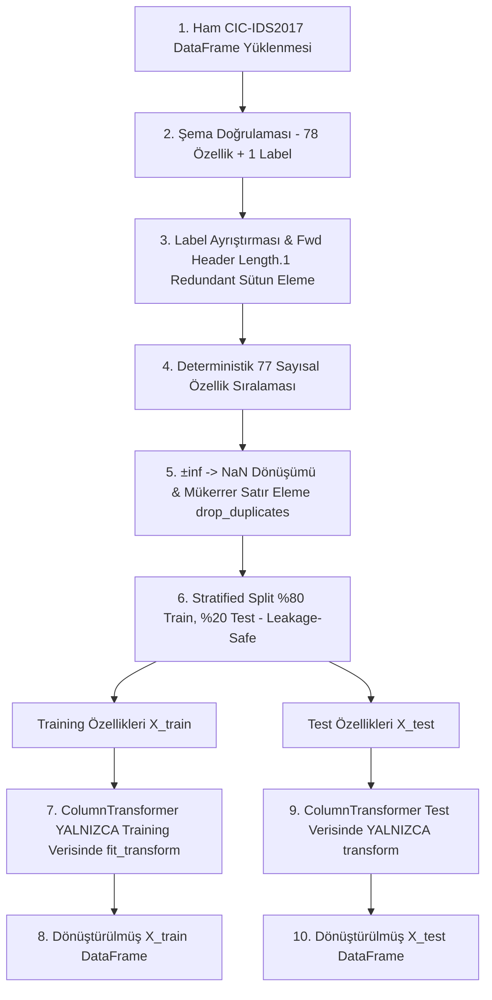

# SecureWatch AI — Makine Öğrenmesi Süreçleri (ML Training & Inference)

Bu belge, SecureWatch AI projesindeki ön işleme (preprocessing) pipeline'ını, ikili sınıflandırma etiket kodlamasını, baseline model eğitimini, performans metriklerini, uçtan uca CLI iş akışını, veri sızıntısını önleme kurallarını ve gelecek aşamaları tanımlar.

---

## 1. Giriş

Platform, ağ trafiği kayıtlarını normal (`BENIGN`) ve şüpheli/saldırı olarak sınıflandırmak için makine öğrenmesi yöntemlerini kullanır. Model başarısının doğruluğu ve güvenilirliği, verinin ön işleme adımlarının, etiket dönüşümünün ve veri sızıntısını (data leakage) önleyen mimarinin doğru kurulmasına bağlıdır.

---

## 2. Ön İşleme Pipeline'ı ve Veri Sızıntısını Önleme (Uygulanan Mimari — Gün 7)

Gün 7 kapsamında, model eğitimine giren verilerin hazırlanması, scikit-learn transformer katmanının oluşturulması ve veri sızıntısını (data leakage) tamamen engelleyen train/test ayrım servisi `app.services.preprocessing_service` altında geliştirilmiştir.


```mermaid
flowchart TD
    A[1. Ham CIC-IDS2017 DataFrame Yüklenmesi] --> B[2. Şema Doğrulaması - 78 Özellik + 1 Label]
    B --> C[3. Label Ayrıştırması & Fwd Header Length.1 Redundant Sütun Eleme]
    C --> D[4. Deterministik 77 Sayısal Özellik Sıralaması]
    D --> E[5. ±inf -> NaN Dönüşümü & Mükerrer Satır Eleme drop_duplicates]
    E --> F[6. Stratified Split %80 Train, %20 Test - Leakage-Safe]
    F --> G1[Training Özellikleri X_train]
    F --> G2[Test Özellikleri X_test]
    G1 --> H[7. ColumnTransformer YALNIZCA Training Verisinde fit_transform]
    H --> I1[8. Dönüştürülmüş X_train DataFrame]
    G2 --> I2[9. ColumnTransformer Test Verisinde YALNIZCA transform]
    I2 --> I3[10. Dönüştürülmüş X_test DataFrame]
```

### 2.1. Eğitim Verisi Hazırlama (`prepare_training_data`)

Model eğitimi öncesinde verinin temizlenmesi ve standart biçime getirilmesi adımları:

1. **Şema Doğrulaması:** Ham DataFrame, canonical CIC-IDS2017 şemasına (`CICIDS2017_FEATURE_COLUMNS`, 78 özellik) göre doğrulanır. Eksik veya fazla özellik varlığında `SCHEMA_MISMATCH` (422) hatası üretilir.
2. **Hedef Değişken (`Label`) Ayrımı:** Yükleme aşamasında opsiyonel olan `Label` sütunu, model eğitimi verisi hazırlanırken **zorunludur**. Eksik veya boş etiketler reddedilir. `Label` sütunu özellik matrisinden ayrılır.
3. **Redundant Özellik Eleme:** CIC-IDS2017 şemasında mükerrer kayıtlı `Fwd Header Length.1` sütunu, şema doğrulamasından **sonra** özellik matrisinden düşürülür.
4. **Model Özellik Sayısı ve Sıralaması:** Model girdisi, `REDUNDANT_COLUMN` çıkarıldıktan sonra tam olarak **77 sayısal özellikten** oluşur ve sıralama deterministiktir.
5. **Sayısal Özellikler ve `Destination Port`:** `Destination Port` dahil 77 özelliğin tamamı sayısal veri tipine dönüştürülür (`pd.to_numeric`). `Destination Port` varsayılan yapıda kategorik sütun olarak zorlanmaz; diğer özelliklerle birlikte sayısal pipeline'a dahil edilir.
6. **Infinity ve Eksik Değer İşleme:** Pozitif ve negatif sonsuz (`+inf`, `-inf`) değerler `NaN` değerine dönüştürülür.
7. **Mükerrer Satır Temizliği:** Overfitting'i önlemek amacıyla tam mükerrer (exact duplicate) satırlar train/test split işleminden **önce** (`drop_duplicates()`) kaldırılır.

### 2.2. Scikit-Learn Ön İşleme Transformer'ı (`build_sklearn_preprocessing_pipeline`)

Özelliklerin imputer ve scaler katmanlarından geçirilmesi için esnek ve unfitted scikit-learn `ColumnTransformer` builder'ı oluşturulmuştur:

- **Sayısal Pipeline (`num`):** `SimpleImputer(strategy="median", keep_empty_features=True)` → `StandardScaler()`. Medyan imputer ile eksik veriler doldurulur, ardından ortalaması 0 ve varyansı 1 olacak şekilde ölçeklenir. `keep_empty_features=True` sayesinde tamamen NaN olan sütunlar çıktı matrisinden kaybolmaz.
- **Varsayılan Yapı:** 77 sayısal özellik, 0 kategorik özellik içerir.
- **Opsiyonel Kategorik Desteği (`cat`):** `SimpleImputer(strategy="most_frequent", keep_empty_features=True)` → `OneHotEncoder(handle_unknown="ignore", sparse_output=False)`. İleride eklenebilecek kategorik alanlar için en sık tekrarlanan değerle doldurma ve bilinmeyen kategorileri sessizce yoksayma (`handle_unknown="ignore"`) desteği mevcuttur.
- **Doğrulamalar:** Sayısal ve kategorik sütun listelerinde çakışma (overlap), mükerrer sütun adı veya boş sütun adı olması durumunda `VALIDATION_ERROR` (422) fırlatılır.
- **Unfitted Nesne Garantisi:** Builder fonksiyonu her çağrıda bağımsız, eğitilmemiş (unfitted) ve klonlanabilir (`sklearn.base.clone`) bir `ColumnTransformer(remainder="drop")` nesnesi döndürür.

### 2.3. Veri Sızıntısını Önleyen Train/Test Ayrımı (`split_and_transform_data`)

Model değerlendirmesinin güvenilirliği için veri sızıntısı (data leakage) tam olarak engellenmiştir:

- **Fit Öncesi Split:** Train/test ayrımı, transformer `fit` edilmeden **önce** gerçekleştirilir.
- **Varsayılan Bölme:** `test_size=0.2`, `random_state=42` ve etiket dağılımını koruyan `stratify=data.targets` kullanır.
- **Katı Stratification Kuralı:** Stratified split başarısız olursa (örneğin veri setinde < 2 sınıf bulunması veya herhangi bir sınıfta < 2 örnek olması durumunda) sessizce normal split'e **düşülmez**; açıkça `VALIDATION_ERROR` (422) hatası verilir.
- **Eğitim Setinde `fit_transform`:** Transformer **yalnızca** eğitim verisi (`X_train`) üzerinde `fit_transform()` edilerek imputer medyanı ve scaler ortalama/standart sapma istatistikleri öğrenilir.
- **Test Setinde YALNIZCA `transform`:** Test verisi (`X_test`) üzerinde asla `fit` veya `fit_transform` çağrılmaz; yalnızca eğitilmiş transformer üzerinden `transform()` çalıştırılır. Test kümesindeki aykırı değerler (outlier) veya eksik veriler eğitim istatistiklerini değiştiremez.
- **Deterministik ve Ayrık İndeksler:** Training ve test indeksleri kesişmez (`train_indices ∩ test_indices = ∅`) ve toplam satır sayısını tam kapsar. İndeksler immutable Python `tuple` tipinde saklanır.
- **Defensive Copy (Derin Kopya) Yalıtımı:** `split_and_transform_data` fonksiyonu giriş `TrainingDataResult` verisinin ve çıktı `X_train`/`X_test`/`y_train`/`y_test` DataFrames/Series nesnelerinin bağımsız derin kopyalarını (`copy(deep=True)`) oluşturur. Çağrıcıların mutable pandas buffer'larını değiştirmesi durumunda kaynak veri veya diğer küme etkilenmez.

---

## 3. İkili Etiket Kodlaması ve Baseline Model Eğitimi (Uygulanan Mimari — Gün 8)

Gün 8 kapsamında ikili etiket kodlaması servisi, baseline performans metrikleri altyapısı, `DummyClassifier` ve `LogisticRegression` modelleri, uçtan uca eğitim iş akışı ve CLI betiği `app.services.model_service` ve `scripts.train_baseline_models` altında geliştirilmiştir.

### 3.1. İkili Saldırı Etiketi Kodlama (`encode_binary_labels`)

CIC-IDS2017 veri setindeki metin tabanlı `Label` değerlerini ikili sınıflandırma hedefine (`0` ve `1`) dönüştürür:

- **Zorunlu Label Varlığı:** `Label` sütunundaki metinler temizlenir (whitespace stripping ve büyük harfe dönüştürme).
- **`BENIGN → 0`:** Normal trafik etiketleri ikili `0` sınıfına atanır.
- **Saldırı Trafigi → `1`:** `BENIGN` dışındaki tüm geçerli saldırı etiketleri ikili `1` sınıfına atanır.
- **Doğrulamalar:** Boş Series, NaN/None içeren Series, metin dışı değerler veya boş dize barındıran Series durumunda `VALIDATION_ERROR` (422) üretilir.
- **Sıralama Garantisi:** Etiket kodlaması, stratified split işleminden **önce** gerçekleştirilir. Stratification ham saldırı metinleri üzerinden değil, ikili `0/1` etiketleri üzerinden yapılır.

### 3.2. Baseline Sınıflandırıcılar (`train_dummy_classifier` & `train_logistic_regression`)

#### 3.2.1. DummyClassifier Baseline (`train_dummy_classifier`)
- **Hiperparametreler:** `strategy="most_frequent"`, `random_state=42`
- **Amaç:** Eğitim verisindeki en sık gözlenen sınıfa göre sabit tahmin üreten en alt referans çizgisidir. Model seçimi amacıyla kullanılmaz.
- **Eğitim & Değerlendirme:** Yalnızca `X_train`/`y_train` üzerinde `fit` edilir, yalnızca `X_test` üzerinde tahmin yürütür.

#### 3.2.2. Logistic Regression Baseline (`train_logistic_regression`)
- **Hiperparametreler:** `class_weight="balanced"` (varsayılan), `max_iter=1000`, `solver="lbfgs"`, `random_state=42`
- **Esnek Sınıf Ağırlığı Desteği:** `"balanced"`, `None` veya özel sözlük `{0: weight_for_0, 1: weight_for_1}` desteklenir. Sözlük anahtarlarının tam olarak `0` ve `1` olması, değerlerin pozitif ve sonlu sayılar olması zorunludur (0, negatif, NaN, inf, bool veya string değerler `VALIDATION_ERROR` 422 ile reddedilir).
- **Eğitim & Değerlendirme:** Yalnızca `X_train`/`y_train` üzerinde `fit` edilir, `X_test` üzerinde tahmin yürütür. `y_test` hedefleri fit aşamasına kesinlikle sızdırılmaz. Katsayı boyutu (`coef_`) 77 sayısal özellik boyutuyla tam eşleşir.

### 3.3. Sınıflandırma Performans Metrikleri (`evaluate_binary_classification`)

İkili sınıflandırma tahminlerini değerlendirmek üzere immutable `ClassificationMetrics` yapısını döndürür:

- **Hedef Sınıflar:** Pozitif sınıf = `1` (Saldırı), Negatif sınıf = `0` (`BENIGN`).
- **Hesaplanan Metrikler:** Accuracy, Precision, Recall, F1-Score.
- **Sıfır Bölme Güvenliği:** Precision, Recall ve F1 hesaplamalarında `zero_division=0` kullanılarak uyarı (warning) üretilmesi engellenmiştir.
- **Confusion Matrix Düzeni:** Metrik raporlarında karmaşıklık matrisi sırası `[[TN, FP], [FN, TP]]` olarak belirlenmiştir.
- **2x2 Matris Garantisi:** Test verisinde tek bir sınıf bulunsa dahi karmaşıklık matrisi 2x2 boyutunda üretilir.

### 3.4. Uçtan Uca Eğitim İş Akışı (`train_baseline_models`)

Bütün ön işleme ve model eğitimi adımlarını sırasıyla çalıştıran public fonksiyondur:

1. `prepare_training_data(df)` ile şema ve veri doğrulaması yapılır.
2. `encode_binary_labels(...)` ile ham etiketler ikili `0/1` hedefe dönüştürülür.
3. İkili hedef içeren bağımsız `TrainingDataResult` oluşturulur.
4. `build_sklearn_preprocessing_pipeline()` ile unfitted preprocessor hazırlanır.
5. `split_and_transform_data(...)` ile leakage-safe train/test ayrımı yapılır.
6. `train_dummy_classifier(...)` çalıştırılır.
7. `train_logistic_regression(..., class_weight="balanced")` çalıştırılır.
8. Metrikler ve sınıf dağılımları `BaselineTrainingReport` olarak döndürülür.

### 3.5. Eğitim CLI Betiği (`scripts.train_baseline_models`)

Backend dizininden aşağıdaki komutla çalıştırılabilir:

```bash
python -m scripts.train_baseline_models --input path/to/training.csv
```

- **Girdi Kontrolü:** `--input` parametresi zorunludur; dosya uzantısının `.csv` olduğunu ve varlığını doğrular.
- **Çıktı Formatı:** Başarılı çalışmada JSON raporunu stdout'a yazar (`allow_nan=False`).
- **Hata Yönetimi:** Geçersiz dosya, şema veya eğitim hatasında sıfırdan farklı bir exit code ile stderr'e kısa ve güvenli bir hata mesajı basar (asla traceback, veri satırları veya mutlak yerel yollar basmaz).
- **Güvenlik & İzolasyon:** Kalıcı model dosyası, Joblib artifact'i veya diske rapor dosyası yazmaz. Tahmin dizisi rapora sızdırılmaz (en fazla 10 elemanlık `prediction_sample` sunulur).

---

## 4. Random Forest Eğitim ve Model Karşılaştırması (Gün 9)

Gün 9 kapsamında Lojistik Regresyon baseline modeline ek olarak, karmaşık ve non-linear ilişkileri yakalamak üzere `RandomForestClassifier` altyapısı ve model karşılaştırma sistemi uygulanmıştır.

### 4.1. Random Forest Eğitim Servisi

Random Forest modeli, veri setindeki non-linear desenleri ve özellik etkileşimlerini öğrenmek üzere tasarlanmıştır:
- Yalnızca `X_train` ve `y_train` üzerinde `fit` edilir.
- `X_test` üzerinde kesinlikle `fit` işlemi yapılmaz, yalnızca `predict` metoduyla tahmin alınır.
- Eğitim süresi (saniye cinsinden) kesin olarak yalnızca `model.fit()` metodunun etrafında ölçülür.
- Model eğitildikten sonra elde edilen *Gini tabanlı* özellik önem dereceleri (feature importances), 77 giriş özelliğiyle doğru biçimde eşleştirilir ve önem derecesine göre büyükten küçüğe deterministik biçimde sıralanır. **Sınırlama:** Gini importance, yüksek kardinaliteli veya sürekli (continuous) değişkenlere eğilim gösterebilir.

Varsayılan parametreler:
- `n_estimators=100`
- `max_depth=10`
- `min_samples_split=2`
- `min_samples_leaf=1`
- `class_weight="balanced"`
- `random_state=42`
- `n_jobs=-1`

### 4.2. Kontrollü Random Forest Deneyleri

Dışarıdan sonsuz grid search veya sınırsız parametre akışına izin verilmemektedir. Bunun yerine kod içine gömülü (hardcoded), dört sabit ve kontrollü deney (variant) mevcuttur:
1. `rf_baseline`: 100 ağaç, derinlik 10, dengeli (balanced) sınıf ağırlığı.
2. `rf_deeper`: 100 ağaç, derinlik 20, dengeli (balanced) sınıf ağırlığı.
3. `rf_unweighted`: 100 ağaç, derinlik 10, sınıf ağırlığı yok (None).
4. `rf_compact`: 50 ağaç, derinlik 5, dengeli (balanced) sınıf ağırlığı.

Bu deneyler her çağrıda aynı sırada çalıştırılır ve deterministik sonuçlar döndürür.

### 4.3. Model Karşılaştırması

Farklı modelleri izole değerlendirmek yerine ortak test/train kümeleri üzerinde tek raporda birleştiren immutable bir karşılaştırma raporu (`FullModelComparisonReport`) üretilir:
- 1 Lojistik Regresyon ve 4 Random Forest (toplam 5 model satırı) içerir.
- Her model için **accuracy, precision, recall, F1-score, confusion matrix** ve **eğitim süresi** raporlanır.
- Yalnızca Random Forest modellerinde (eğer mevcutsa) en yüksek öneme sahip **ilk 10 özellik** gösterilir.
- Karşılaştırma altyapısı objektif metrikleri sergiler; sistemde hiçbir modeli otomatik "kazanan" veya "best model" olarak atamaz. ROC-AUC ve nihai model seçimi Gün 10 kapsamında yapılacaktır.

### 4.4. CLI ve Güvenlik
Eğitim betiği komut satırından `python -m scripts.train_baseline_models --input <csv> --compare-random-forest` opsiyonu ile çalıştırıldığında:
- Eski CLI kullanımı `--compare-random-forest` bayrağı verilmediğinde bozulmadan çalışmaya devam eder.
- Çıktı JSON dökümü güvenlidir: Estimator (model nesnesi), ham veri matrisleri veya test tahmin (predict) dizileri asla dışa sızdırılmaz.
- `allow_nan=False` kullanılarak geçersiz JSON (NaN, +inf, -inf) üretimi engellenir.
- Kullanıcıya yansıyan hatalarda mutlak sistem yolları, traceback detayları veya hassas veri gizlenmiştir.
- Komut satırı hiçbir koşulda Joblib model dosyası, PKL kalıntısı veya rapor dosyası diske kaydetmez. Sadece stdout üzerinden çıktı döndürür.

---

## 5. Model Değerlendirme, Karar Eşiği Seçimi ve Nihai Model Seçimi Altyapısı (Uygulanan Mimari — Gün 10)

Gün 10 kapsamında, veri sızıntısı engelleyen sızıntısız validation altyapısı üzerinde olasılık çıkarımı, gelişmiş ROC/PR değerlendirmesi, test verisinden yalıtılmış karar eşiği optimizasyonu, deterministik nihai model seçimi, risk seviyesi sınıflandırması ve CLI entegrasyonu `app.services.model_service` altında uygulanmıştır.

### 5.1. Olasılık Çıkarımı (`extract_positive_probabilities`)
- **Dinamik Sınıf Tespiti:** Pozitif saldırı sınıfının (`1`) indeks konumu doğrudan `estimator.classes_` dizisi üzerinden dinamik olarak tespit edilir.
- **Hedef Sözleşmesi:** Sadece ikili `[0, 1]` sınıflandırma hedeflerini destekler; tek sınıflı veya çok sınıflı durumlarda `VALIDATION_ERROR` (422) fırlatır.
- **Olasılık Doğrulaması:** Çıkarılan olasılık değerlerinin sonlu (`finite`) ve `[0.0, 1.0]` aralığında olması zorunludur. `predict_proba` desteği olmayan modeller reddedilir.
- **Güvenlik İzolasyonu:** Eğitilmiş estimator nesneleri veya ham olasılık dizileri (`np.ndarray` / `pd.Series`) hiçbir zaman JSON raporuna sızdırılmaz.

### 5.2. Gelişmiş Değerlendirme Metrikleri (`evaluate_probability_metrics`)
Olasılık tahminleri ile gerçek hedefleri karşılaştırarak kapsamlı ve kesintisiz performans metrikleri üretir:
- **ROC-AUC & PR-AUC / Average Precision:** `roc_auc_score` ve `average_precision_score` ile genel ayrım gücü ölçülür.
- **Eğri (Curve) Analizi:** `roc_curve` ve `precision_recall_curve` hesaplanır. Sonsuz eşik (threshold) değerleri (`+inf`, `-inf`, `nan`) JSON uyumluluğu için güvenli bir şekilde Python `None` değeriyle temsil edilir.
- **Temel Metrikler & Confusion Matrix:** Karar eşiğinde hesaplanan Accuracy, Precision, Recall, F1-score ve tam `((TN, FP), (FN, TP))` 2x2 karmaşıklık matrisini içerir.
- **Sıfır Bölme Koruması:** Eğri ve metrik hesaplamalarındaki sıfıra bölme riskleri (`zero_division=0`) ile engellenir.

### 5.3. Validation Tabanlı Karar Eşiği Seçimi (`select_decision_threshold` & OOF Olasılık Üretimi)
Model karar eşiği, test verisi asla görülmeden yalnızca eğitim kümesi üzerindeki Out-of-Fold (OOF) olasılıkları üzerinden optimize edilir:
- **OOF Olasılık Üretimi:** Yalnızca `X_train` ve `y_train` kullanılarak varsayılan `StratifiedKFold(n_splits=5, shuffle=True, random_state=42)` uygulanır. Her fold için estimator bağımsız clone edilir (`sklearn.base.clone`). Her eğitim satırı, modelin o satırı görmediği fold'dan tam olarak bir kez validation olasılığı alır.
- **Test Verisi İzolasyonu:** Test verisi (`X_test`/`y_test`) eşik optimizasyonuna kesinlikle dâhil edilmez; yalnızca validation üzerinde seçilmiş olan eşik değeri ile son değerlendirmede test edilir.
- **Aday Eşik Tarama:** Varsayılan olarak `0.10` ile `0.90` arasında `0.05` adımlı (17 adet) aday eşik taranır (`score >= threshold` tahmin kuralı ile).
- **Operasyonel Kısıtlar & Seçim Politikası:** Varsayılan iş gereksinimi olarak `min_recall = 0.95` (En az %95 saldırı yakalama) ve `max_false_positive_rate = 0.05` (En fazla %5 yanlış alarm) kısıtları uygulanır. Bu kısıtları sağlayan adaylar arasından sırasıyla en yüksek Recall, en yüksek F1, en yüksek Precision, en düşük FPR ve en düşük eşik (threshold) tercih edilir.
- **Sessiz Fallback Yoktur:** Hiçbir eşik operasyonel kısıtları karşılamıyorsa sessizce varsayılan 0.50 eşiğine veya en yüksek accuracy değerine gizli fallback yapılmaz; açıkça `is_selected = False` dönülerek eşik seçilemediği bildirilir.

### 5.4. Değerlendirilen Model Adayları
Nihai seçim altyapısı, sistemde tanımlı 5 kontrollü model adayını aynı validation kısıtlarıyla değerlendirir:
- `lr_baseline`: Lojistik Regresyon (`class_weight="balanced"`).
- `rf_baseline`: Random Forest (`n_estimators=100`, `max_depth=10`, `class_weight="balanced"`).
- `rf_deeper`: Random Forest (`n_estimators=100`, `max_depth=20`, `class_weight="balanced"`).
- `rf_unweighted`: Random Forest (`n_estimators=100`, `max_depth=10`, `class_weight=None`).
- `rf_compact`: Random Forest (`n_estimators=50`, `max_depth=5`, `class_weight="balanced"`).

> [!NOTE]
> `DummyClassifier` modeli yalnızca en alt referans çizgisi (baseline) olarak raporlarda yer alır; gerçek model adayları arasında sayılmaz ve nihai model seçimine kesinlikle katılamaz.

### 5.5. Deterministik Nihai Model Seçimi (`select_final_model`)
Aday modeller arasından kazanan modeli belirleyen algoritma tamamen deterministiktir ve çalışma zamanı değişkenliğinden yalıtılmıştır. Operasyonel kısıtları (min_recall, max_fpr) sağlayan adaylar arasında eşitlik (tie) yaşanması durumunda aşağıdaki kesin sıralama kuralı uygulanır:

1. **En yüksek validation Recall** (`validation_recall descending`)
2. **En düşük validation False Positive Rate** (`validation_false_positive_rate ascending`)
3. **En yüksek validation F1-score** (`validation_f1_score descending`)
4. **En yüksek validation Average Precision / PR-AUC** (`validation_average_precision descending`)
5. **Variant adının alfabetik sırası** (`variant_name ascending` — kesin ve son eşitlik bozucu)

Özellikle:
- **Çalışma Süresi Bağımsızlığı:** Eğitim süresi (`training_duration_seconds`) donanım, OS zamanlaması ve CPU yüküne göre dalgalanma gösterebildiği için tie-break anahtarından tamamen çıkarılmıştır; yalnızca raporlarda gözlem amacıyla korunur.
- **Test Metriklerinden İzolasyon:** Test kümesi üzerindeki başarı sonuçları (`test_metrics`) model seçildikten sonra hesaplanır ve hiçbir koşulda seçim kararına etki edemez.
- **Sessiz Fallback Yoktur:** Hiçbir aday kısıtları sağlamazsa sistem model seçmez (`is_selected = False`); sabit aday sırasına veya en yüksek accuracy adayı gibi alternatiflere fallback yapılmaz.

### 5.6. Operasyonel Risk Seviyeleri (`classify_risk_level`)
Modelin ürettiği sonlu olasılık değeri (`probability`), karar eşiğinden bağımsız olarak operasyonel önem ve tehdit seviyelerine sınıflandırılır:
- `LOW` (Düşük): `0.00 <= p < 0.30`
- `MEDIUM` (Orta): `0.30 <= p < 0.60`
- `HIGH` (Yüksek): `0.60 <= p < 0.85`
- `CRITICAL` (Kritik): `0.85 <= p <= 1.00`

> [!IMPORTANT]
> Risk seviyeleri, binary saldırı karar eşiğinden (`score >= selected_threshold`) bağımsız operasyonel kategorilerdir. Düşük eşikli bir modelde `MEDIUM` aralığındaki bir olasılık "saldırı" olarak sınıflandırılabileceği gibi, operasyonel müdahale önceliği risk seviyesine göre yönetilir.

### 5.7. CLI Entegrasyonu ve Güvenlik Sözleşmesi (`scripts.train_baseline_models`)
Eğitim CLI betiğine yeni opsiyonlar eklenmiş ve güvenlik kural setleri uygulanmıştır:
- **Yeni Komut Parametreleri:**
  - `--select-final-model`: Validation tabanlı deterministik nihai model seçimini çalıştırır.
  - `--min-recall`: Minimum validation Recall kısıtı (varsayılan: `0.95`).
  - `--max-fpr`: Maksimum validation FPR kısıtı (varsayılan: `0.05`).
  - `--cv-splits`: Stratified K-Fold fold sayısı (varsayılan: `5`).
- **Karşılıklı Dışlama:** `--select-final-model` ile `--compare-random-forest` seçenekleri aynı komutta birlikte kullanılamaz; denendiğinde CLI açık hata mesajı vererek reddeder.
- **Güvenli JSON Çıktısı:** `json.dumps(..., allow_nan=False)` zorunluluğu uygulanır. Rapor sözlüğüne hiçbir model estimator nesnesi, ham Pandas/NumPy dizisi veya sistem yolu sızamaz.
- **İzolasyon ve Temizlik:** Başarılı çıktılar yalnızca `stdout`, hatalar `stderr` üzerinden verilir. Hata durumlarında Python traceback dökümü, mutlak dosya yolları (`C:\...` vb.) veya veritabanı bilgileri gizlenir. Diskte `.joblib`, `.pkl` veya geçici rapor artefaktı bırakılmaz.

---

## 6. Gelecek Aşamalar (Henüz Uygulanmayan Özellikler)

Aşağıdaki bileşenler Gün 10 itibarıyla **uygulanmamıştır** ve projenin sonraki aşamalarında geliştirilecektir. Bu özellikler sistemde mevcutmuş gibi değerlendirilmemelidir:

- **Joblib/PKL Model Serialization:** Eğitilmiş en iyi modelin, preprocessor pipeline'ının ve karar eşiğinin diske kalıcı olarak kaydedilmesi (`model_persistence`).
- **Model Registry:** Versiyonlanmış model kayıt arşivi ve aktif model yönetimi.
- **Inference Servisi:** Kaydedilmiş modelin belleğe yüklenerek yeni ağ akışları üzerinde hızlı tahmin yürütmesi.
- **Tahmin API Endpoint'i:** REST API üzerinden (`/api/v1/inference` vb.) dış sistemlerden gelen ağ kayıtları için anlık tahmin sunulması.
- **Background Worker:** Yüklenen CSV analiz işlerinin arka plan işçileri (Celery / ARQ vb.) tarafından asenkron işlenmesi.
- **Gerçek Zamanlı Trafik Analizi:** Canlı ağ arayüzünden (pcap/socket) veri akışı dinlenmesi ve anlık müdahale.
- **Production Model Deployment:** Seçilen modelin canlı prodüksiyon ortamına alınması ve uçtan uca çalıştırılması.
- **Frontend Model Sonuç Ekranları:** React arayüzünde model seçim raporlarının, ROC/PR eğrilerinin ve risk dağılımlarının görselleştirilmesi.
- **Gerçek CIC-IDS2017 Performans Karşılaştırması:** Tam veri seti üzerinde bütün adayların eğitilerek nihai projenin gerçek kıyaslama tablosunun yayınlanması.

---

## 7. Risk Skorlama ve Eşik (Threshold) Yönetimi

Modelin ürettiği saldırı olasılığı (`p`), operasyonel aksiyonlara yön vermek üzere Gün 10'da uygulanan aralıklarla yönetilir:

$$\text{Risk Skoru} = \text{round}(p \times 100)$$

### 7.1. Uygulanan Risk Seviyeleri (`classify_risk_level`)

| Risk Seviyesi (`risk_level`) | Olasılık Aralığı (`p`) | Risk Skoru Aralığı | Operasyonel Açıklama |
| :--- | :--- | :--- | :--- |
| **`LOW`** (Düşük) | `0.00 <= p < 0.30` | 0 – 29 | Normal veya çok düşük riskli trafik, analist müdahalesi gerekmez. |
| **`MEDIUM`** (Orta) | `0.30 <= p < 0.60` | 30 – 59 | Şüpheli ağ davranışı, analist izleme listesine alabilir. |
| **`HIGH`** (Yüksek) | `0.60 <= p < 0.85` | 60 – 84 | Yüksek saldırı olasılığı, güvenlik olayına (incident) dönüştürülmesi önerilir. |
| **`CRITICAL`** (Kritik) | `0.85 <= p <= 1.00` | 85 – 100 | Acil tehdit tespiti, otomatik alarm ve analist tarafından anlık müdahale gerektirir. |

> [!NOTE]
> Yukarıdaki risk seviyeleri, modelin ikili sınıflandırma karar eşiğinden (`selected_threshold`) tamamen bağımsız olarak hesaplanan operasyonel önem dereceleridir. Karar eşiği ise veri setinin doğasına ve kısıtlara göre dinamik olarak optimize edilir.

---

## 8. Güvenli Inference ve Analysis API (Gün 11)

Gün 11 kapsamında, model paketinin güvenli yüklenmesi, uçtan uca çıkarım (inference) veri akışı, analiz işlerinin (AnalysisJob) durum yönetimi ve API üzerinden senkron işlenmesi `app.services` ve `app.api` altında geliştirilmiştir.

### 8.1. Model Paketi Güven Sınırı

Model paketlerinin yüklenmesi ve işlenmesinde katı güvenlik kuralları uygulanır:
- **API Erişimi Yoktur:** Model paketi kullanıcı tarafından API üzerinden doğrudan yüklenemez.
- **Güvenli Dizin:** Model paketi yalnızca backend sunucusunun (ve yöneticisinin) kontrol ettiği, çevre değişkeni ile belirtilen güvenli dizinden (`model_package_path` ayarı) okunur.
- **Git Dışı Yapı:** Gerçek model paketi Git reposuna dâhil edilmez (yalnızca yerel üretim ortamında bulundurulur).
- **Yönetici Sorumluluğu:** `joblib`/pickle tabanlı nesnelerin yapısı gereği uzaktan kod çalıştırma riski taşıması sebebiyle, model paketleri yalnızca güvenilir yönetici (Admin/DevOps) tarafından sunucuya sağlandığı sürece yüklenebilir.
- **Dosya Doğrulaması:** Path traversal girişimleri (`../`), farklı dosya uzantıları (örn. `.exe`, `.sh`) ve güvenli dizin dışına çıkma girişimleri yükleme aşamasında kesin olarak reddedilir.
- **Paket İçeriği:** Güvenli model paketi bir Python sözlüğü (`dict`) olup şunları barındırmak zorundadır: `estimator`, `preprocessor` (fitted preprocessor), `features` (77 özellik adı tam eşleşmeli), `threshold` ve `metadata`.
- **Estimator Sözleşmesi:** Estimator, `predict_proba()` sözleşmesini karşılamalı ve pozitif/negatif (`0`, `1`) ikili sınıflandırma sınıflarına (`classes_`) sahip olmalıdır.

### 8.2. Inference Veri Akışı

Model tahmini, verinin diskten okunmasından veritabanına yazılmasına kadar şu sıralı adımlarla gerçekleştirilir:

1. **Dosya Çözümleme:** Yüklenen ve saklanan CSV dosyasının `file_hash` yolu güvenli dizinden (`upload_dir`) çözülür (path traversal koruması ile).
2. **Şema Doğrulaması:** CSV dosyasının CIC-IDS2017 şemasına uygunluğu doğrulanır.
3. **Hedef Temizliği:** Opsiyonel `Label` sütunu CSV'de mevcutsa model girdisinden çıkarılır.
4. **Redundant Sütun:** `Fwd Header Length.1` redundant sütunu varsa girdiden silinir.
5. **Kanonik Sıralama:** Geriye kalan tam 77 kanonik sayısal özellik, modelin eğitildiği özellik sırasına (`model_package["features"]`) göre deterministik biçimde dizilir.
6. **Preprocess (Yalnızca Transform):** Fitted preprocessor üzerinde **yalnızca** `transform()` fonksiyonu çağrılır.
7. **İzolasyon:** Inference aşamasında `fit()` veya `fit_transform()` kesinlikle çalıştırılmaz.
8. **Tahmin (Predict Proba):** Model üzerinden `predict_proba()` çağrılarak sınıf `1`'e (saldırı) ait pozitif olasılık değeri elde edilir.
9. **Eşik Kararı:** Model paketinden gelen `threshold` değeri kullanılarak ikili saldırı kararı (`is_attack`: `p >= threshold`) verilir.
10. **Risk Sınıflandırması:** Olasılığa bağlı olarak `LOW`, `MEDIUM`, `HIGH` veya `CRITICAL` risk seviyesi belirlenir.
11. **Kayıt:** Tüm tahminler veritabanına `DetectionResult` kayıtları olarak topluca aktarılır.

Risk seviyesi sınırları (karar eşiğinden bağımsız operasyonel sınıflandırmadır):
- `LOW`: `0.00 <= p < 0.30`
- `MEDIUM`: `0.30 <= p < 0.60`
- `HIGH`: `0.60 <= p < 0.85`
- `CRITICAL`: `0.85 <= p <= 1.00`

### 8.3. AnalysisJob İşlem Akışı (Durum Makinesi)

Yüklenen CSV işlerinin analiz durumları aşağıdaki gibi ilerler:
- `PENDING → PROCESSING → COMPLETED`
- `PENDING → PROCESSING → FAILED`

- **Sahiplenme ve Atomik Geçiş:** Bir iş yalnızca `PENDING` durumundayken sahiplenilebilir. `PENDING → PROCESSING` geçişi `id` ve `status=PENDING` koşulu içeren atomik bir SQL `UPDATE` komutu ile gerçekleştirilir. Etkilenen satır sayısı `0` ise geçiş başarısız sayılır (409 Conflict). Bu sayede aynı işin iki farklı istek veya süreç tarafından aynı anda çalıştırılması önlenir.
- **Sahiplenme Zamanlaması:** Atomik sahiplenme işlemi, CSV okuma, model yükleme ve tahmin hesaplamalarından hemen önce yapılır.
- **Transaction Bütünlüğü:** Başarılı analizlerde `COMPLETED` durumu ve `DetectionResult` kayıtları tek bir veritabanı işleminde (commit) kaydedilir.
- **Hata ve Rollback:** İşlem sırasında (örn. bozuk veri, model hatası, disk hatası) hata alınırsa, kısmi `DetectionResult` kayıtları anında `rollback` edilir (0 kayıt bırakılır) ve iş `FAILED` durumuna çekilir. İstemciye ve veritabanı hata mesajına mutlak sistem yolları (`C:\...`) veya Python traceback dökümleri sızdırılmaz.
- **Senkron İşleme:** API'den tetiklenen işlem senkron yürütülmektedir; arka planda Celery, ARQ veya background queue bulunmamaktadır.

### 8.4. DetectionResult Veri Modeli

Tahmin sonuçlarının kaydedildiği veritabanı sözleşmesi:
- Her tahmin (`DetectionResult`), kendisini üreten bir `AnalysisJob` kaydına dış anahtar (Foreign Key) ile bağlıdır.
- `row_index`: Orjinal CSV içindeki satırın 0 tabanlı sırasını temsil eder.
- `attack_probability`: Modelin ürettiği saldırı olasılığıdır (`0.0 - 1.0`).
- `is_attack`: Model karar eşiğine göre ikili sonuçtur (True/False).
- `risk_level`: Dört operasyonel sınıftan (`LOW`, `MEDIUM`, `HIGH`, `CRITICAL`) biridir (native PostgreSQL Enum kullanılmamış, taşınabilirlik için `String` tercih edilmiştir).
- Benzersizlik (Unique Constraint): `(job_id, row_index)` kombinasyonu tabloda tamamen benzersizdir.
- Cascade (Silme Kuralı): Analiz işi (`AnalysisJob`) silindiğinde ona bağlı tüm `DetectionResult` kayıtları otomatik olarak silinir.
- Tabloda tahmin model nesnesi (estimator), ham CSV satırı veya dönüştürülmüş NumPy tensörleri saklanmaz; yalnızca nihai, hafif karar metrikleri barındırılır.

### 8.5. API Sözleşmesi ve RBAC Kuralları

Senkron analiz işlemleri için aşağıdaki uç noktalar tasarlanmıştır:

#### POST /api/v1/analysis/{job_id}/process
- `PENDING` durumundaki işi senkron çalıştırır. Sonuç olarak işlenen kayıt sayısını döner.
- Durum `PENDING` değilse `409 Conflict` döner.
- Analyst kendi yüklediği işi çalıştırabilir, Admin herkesin işini çalıştırabilir.

#### GET /api/v1/analysis/{job_id}/results
- `COMPLETED` işler için tahmin sonuçlarını listeler. İş tamamlanmamışsa `409 Conflict` döner.
- Çıktı `row_index ASC` yönünde sıralıdır.
- `skip` ve `limit` (max 100) kullanılarak sayfalama (pagination) yapılır.
- `is_attack` (`true/false`) ve tip güvenli `risk_level` (`LOW`, vb.) filtrelerini destekler (ikisi de optional). `is_attack is not None` bazlı filtrelenir. Geçersiz `risk_level` sorguları `422 Unprocessable Entity` ile reddedilir.

#### GET /api/v1/analysis/{job_id}/summary
- Toplam (`total_records`), normal (`normal_count`) ve saldırı (`attack_count`) kayıt sayımlarını döner.
- Ayrıca risk seviyesi kırılımlarını (`LOW`, `MEDIUM`, `HIGH`, `CRITICAL` sayımları) barındırır.
- Boş çıkan risk seviyeleri sonuçta `0` olarak yer alır. İşin `completed_at` zaman damgası rapora eklenir.

**RBAC Kuralları:**
- Analyst rolündeki kullanıcılar yalnızca kendi ID'leri (`user_id`) ile oluşturdukları analiz kayıtlarına erişebilirler.
- Admin rolü tüm kayıtlar üzerinde işlem yetkisine sahiptir.
- Erişim hakkı olmayan veya mevcut olmayan `job_id` sorgularında bilgi sızdırmamak adına `404 Not Found` döndürülür.
- Tüm uç noktalarda kimlik doğrulama, kullanıcı gridisinden değil güvenli `access_token` üzerinden çıkarılır.

### 8.6. Güvenlik ve Gizlilik Sınırları

- API üzerinden model, preprocessor veya herhangi bir yapılandırma dosyası alınmaz/verilmez.
- Model veya preprocessor nesneleri HTTP Response içine asla konulmaz.
- Ham DataFrame, NumPy bellek dizileri ve CSV dosya içeriği yanıt gövdesine (response body) sızdırılmaz.
- Mutlak sistem yolları ve traceback sızıntıları kullanıcı yanıtlarından ayıklanmıştır.
- API model yükleme ve okuma işlemleri, kullanıcı tarafından sağlanan parametrelerle path oluşturulmasına izin vermez (kullanıcı kontrollü path yok).
- Proje içindeki test takımından dönen `354 passed` bildirimi, sistemin yazılım mühendisliği kurallarını ve sözleşmelerini başarıyla sağladığını gösterir; gerçek bir IDS saldırı tespit model doğruluğunu veya üretim performansını kanıtlamaz.

### 8.7. Henüz Uygulanmayan Özellikler (Gelecek Aşamalar)

- **Gerçek Üretim Modelinin Paketlenmesi:** Güvenli pakete konmuş eğitimli gerçek model henüz yerleştirilmemiştir.
- **Model Registry ve Sürüm Geçmişi.**
- **Asenkron İş Kuyruğu:** Analiz işlemlerinin Celery/Redis gibi worker'lara devredilmesi.
- **Canlı Ağ Trafiği Inference'ı:** Dosya yerine paket (pcap) düzeyinde anlık dinleme yapılması.
- **Incident (Olay) Oluşturma ve Yönetimi:** Tespit edilen anormalliklerin analist ekranına güvenlik olayı (incident) olarak düşürülmesi.
- **Analist Atama:** Olaylara durum (Açık, Kapalı, Yalan Pozitif) ve personel ataması yapılması.
- **Frontend / Dashboard Entegrasyonu:** React uygulamasının geliştirilmesi.
- **Gerçek Veri Üzerinde Üretim Performans Ölçümü.**
